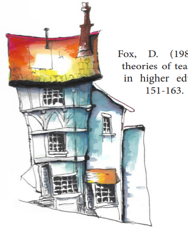
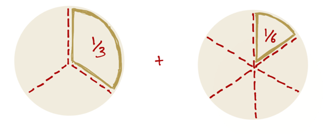

## Acknowledgement of Country

## What are the goals for today?

Admin and Strategies:

- Admin: hours, payslips, timetables, who to ask about what
- Strategies: facilitating labs, marking and feedback, inclusive teaching

## Schedule

- 09:30	1. How to be a tutor
- 11:00	Morning Tea
- 11:30	2. Facilitating Classes
- 13:00	Lunch
- 13:30	3. Feedback and Marking
- 15:00	Afternoon Tea
- 15:30	4. Inclusive Teaching
- 17:00	Finish

## Journey as an Educator

Everybody here has experience as a **learner** but this might be the start of your journey as an **educator**.

Or you might have had some experiences before... (maybe not as a job!)

Examples: piano teaching kids, coaching soccer team, homework help for highschoolers, leading a club or society  

**Who here has had a teaching experience before?**

## Charles' Teaching Journey

- 2003: (in highschool): helping out percussionists in junior concert band
- 2005: First work as a private percussion/drumset teacher
- 2007: (maybe?): Tutor for MATH1013/14 at ANU (!)
- 2014-2016: Tutor and Casual Lecturer at ANU (COMP1720, MUSI3309, COMP2100, COMP2300)
- 2019: Lecturer at ANU (COMP2300/6300, COMP1720/6720, COMP4350/8350)
- 2022: Developed study programs for Human Centred and Creative Computing (HCCC-MAJ, HCCC-MIN, HCCC-SPEC, HCCM-SPEC)
- 2025: New this year! Training new CSAs, teaching COMP3900/6390.

## Teaching Values

I'm a Senior Fellow of the Higher Education Academy where we follow a [Professional Standards Framework](https://www.advance-he.ac.uk/teaching-and-learning/psf) one part of this is 5 _values_:

- **V1**: respect individual learners and diverse groups of learners
- **V2**: promote engagement in learning and equity of opportunity for all to reach their potential
- **V3**: use scholarship, or research, or professional learning, or other evidence-informed approaches as a basis for effective practice
- **V4**: respond to the wider context in which higher education operates, recognising implications for practice
- **V5**: collaborate with others to enhance practice

## Computing Education

## What's tutoring like?

- **Teaching labs:** standing at the front speaking to a whole class, helping individuals with work, answering questions, listening to problems and issues, helping students learn!
- **Marking assessments:** evaluating work (what have students learned?), explaining evaluations, writing feedback, explaining reasoning
- **Meeting with course convenors and other tutors:** going to meetings, understanding duties and tasks, providing ideas/info, incorporating feedback
- **Filling in timesheets, doing admin:** navigating ANU websites, understanding rights/responsibilities at work, asking for help

## Timesheets and hours

Every two weeks you will need to fill in a timesheet on HORUS (the ANU HR website). You won't get paid until you fill in the timesheet and your manager (course convenor) approves it!

Tricky because of way ANU accounts for teaching hours through "earnings codes" where 1 unit of the code may include more than 1 hour of work.

- T42: Marking: 1-to-1 ratio
- T44: "Other required activity": 1-to-1 ratio
- T21: **Teaching** "Supplementary / scaffolded form of delivery" (that is, tutorials or labs): 1-to-3 ratio (1 hour teaching + 2 hours of "associated working time")
- T23: **Repeat Teaching** "Supplementary / scaffolded form of delivery" (1 hour teaching + 1 hour associated working time)

[ANU Academic Casual Sessional Rates](https://services.anu.edu.au/human-resources/salaries-benefits/academic-casual-sessional-rates)

## What is associated working time?

[S2.5---S2.6](https://services.anu.edu.au/human-resources/enterprise-agreement/schedule-2-casual-sessional-academic-activities-and-rates)

- Preparing of teaching activities
- Contemporaneous marking
- Administration directly associated with a teaching activity
- Face to face consultation immediately prior to and following a face to face teaching activity
- Online consultation (e.g. email, messages, forums) immediately prior to and following an online teaching activity
- Attendance at meetings specifically for the purpose of assisting the CSA staff member to prepare for their teaching activity

## Why do we do it this way?

- It's in the Enterprise Agreement
- Provides guarantees of hours throughout the semester
- Protects casual staff against unfair requests from academics (e.g., "You'll have to attend the lecture to find out what to teach! No you don't get paid for that!!")

## Safety

## Where to get help 

- Other tutors: course team / communication channels (varies by course)
- Convenor (your direct manager)
- School of Computing front desk (CSIT Level 3 or <admin.comp@anu.edu.au>)
- Peter Hoefner - Associate Director (Education) in School of Computing: <peter.hoefner@anu.edu.au>

## Working with convenors

## Getting to know you as a learner (5m task!)

Reflect on your teaching experiences, expectations and learning needs.

Select three sticky notes from your table and answer these three questions:

- What __do you enjoy__ or __expect to enjoy__ about tutoring?
- What challenges __have you faced__ or do you __expect to face__ as a tutor?
- What aspects of tutoring would you most like support with?

When you are ready, stand up and place your sticky notes on the corresponding poster!

# Theories of teaching

## Fox’s "Personal Theories of Teaching"

- You are going to a see a series of images as metaphors of different teaching approaches.
- Consider each image as they are presented. What kind of teaching do you think the image represents?
- Enter your idea in  _Poll Everywhere_.

## Transfer Theory

__The teacher is like a fountain of knowledge.__

- The teacher transfers knowledge to the learner who “receives” it.
- Learners are passive and have very little autonomy in their learning.
- The teacher presents, instructs, transfers, transmits and conveys learning.
- Often found in lectures, presentations, seminars, reading lists and study notes etc.

## Shaping Theory

__The teacher is like a craftsperson or a sculptor.__ 

- The teacher shapes and “moulds” knowledge in the learner.
- Learners have limited autonomy in their learning.
- The teacher demonstrates, instructs, coaches and develops learning.
- Often found in lectures, labs and practicals, workshops etc.

## Building Theory

__The teacher is like an architect, draftsperson or city planner.__

- A hybrid of transfer and shaping.
- The teacher provides the "materials” and “plans” for the learners to build from.
- Learners have more autonomy to apply knowledge and skills to achieve predetermined outcomes.
- The teacher instructs, enables, directs and structures learning.
- Often found in lectures, labs and practicals, workshops etc.

## Travelling Theory

-__The teacher is like an expert guide.__

- Learning is a journey of exploration facilitated by the teacher.
- Learner has a high degree of autonomy in navigating their learning path.
- Teacher monitors, guides, facilitates, and enables learning. They point the way.
- Often found in problem and project-based learning, research projects etc.

## Growing Theory

__The teacher is like a gardener.__

- The learner produces knowledge through exploration and discovery.
- Learners have the autonomy to actively define their own learning path.
- The teacher encourages, promotes, cultivates and nurtures learning.
- Often found in self-directed learning, problem and project-based learning etc.
- An on-going, evolving process.

## Task: What do these mean to us? (2mins)

These are _metaphors_ for the dynamics between students and teachers, not intended to be universal!

- Which of these approaches have you experienced?
- What was the context and how did it affect learning?
- Which of these approaches do you think are relevant to your own teaching?

## Applying theory to practice

Imagine you are teaching your students how to add fractions.

- In the teaching materials, you find  __5 activity designs:__
- You examine each activity and its teaching approach.
- Thinking back on  __Fox’s Theories of Teaching,__  you decide to match  _each activity_  to  _one_  of Fox’s metaphors.

## Approach A: Methods and Questions

The tutor explains initial concept and demonstrates a prescribed method to solve the problems.

- The tutor presents some basic examples.
- The tutor provides a method to solve similar examples.

The tutor provides materials and tools for students to use to solve more complex problems.

- The students solve set problems from the textbook using the resources provided by the teacher.

Some students solve the problems quickly and find them too easy

- The tutor asks them to find more challenging questions to attempt but allows them to leave early.

## Approach B: Activity Stations

- The tutor sets out a series of problems across several tables. The problems become progressively more challenging as they go. The tutor provides resources and tools to help solve the problems.
- Students self-diagnose which activity station they should be at. They can stay at any station as long as they want and can move at any time.
- The tutor encourages group work and moves around the room helping students who get stuck.

## Approach C: Steps

The tutor presents the following steps on the whiteboard.

1. Make the denominators (bottom numbers) the same.
2. Add the numerators (top numbers) and put them over the same denominator.
3. Simplify the fraction (if needed).

The students complete practice questions from the textbook: 

## Approach D: Visualisation

The tutor explains the concept of fractions by visualising them as pizza slices. The tutor draws the following image on the board:

- The tutor provides the students fraction problems to solve by using visualisation. The tutor moves around the room checking the students’ work.
- When the students have understood the concept, the tutor shows on the board how to answer these types of questions  _without_  the visualisation (i.e. finding the common denominator).

## Approach E: Working in Groups

The tutor asks students to work in groups to solve fraction problems.

Some students are stuck right away.

- The tutor gives them simpler problems to solve.
- The tutor encourages students at a similar level of understanding to work together.

Some students can solve problems by drawing diagrams but need to do this for every problem.

- The tutor provides problems that encourage more advanced techniques.
- The tutor provides tools and resources to support the students.

Some students solve the problems quickly and find them too easy

- The tutor has more challenging problems prepared, such as mixed fractions.
- The tutor makes sure there are sufficient tools and resources for support.

## Applying theory to practice

- **Transfer:** presents, instructs, transfers, transmits and conveys learning.
- **Shaping:** demonstrates, instructs, coaches and develops learning.
- **Building:** instructs, enables, directs and structures learning.
- **Travelling:** monitors, guides, facilitates, and enables learning. They point the way.
- **Growing:** encourages, promotes, cultivates and nurtures learning.

## Applying theory to practice

- No single approach is “correct”. Each has its purpose and context. They are all integral to effective teaching practice.
- No approach is “singular”. They are used in combination in various ways and often occur at the same time in different contexts or at different levels of learning.
- No approach is “universal”. In each class, there will be learners with their own individual learning needs. Your teaching approach should be responsive, adaptive and inclusive.

"Everything works somewhere; nothing works everywhere."
