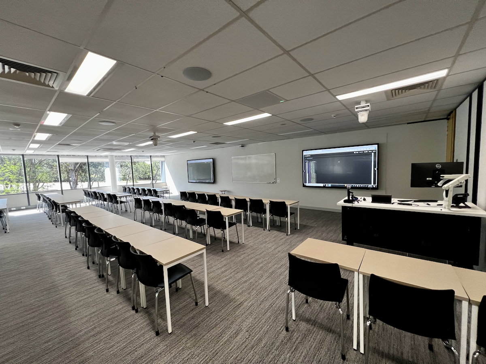
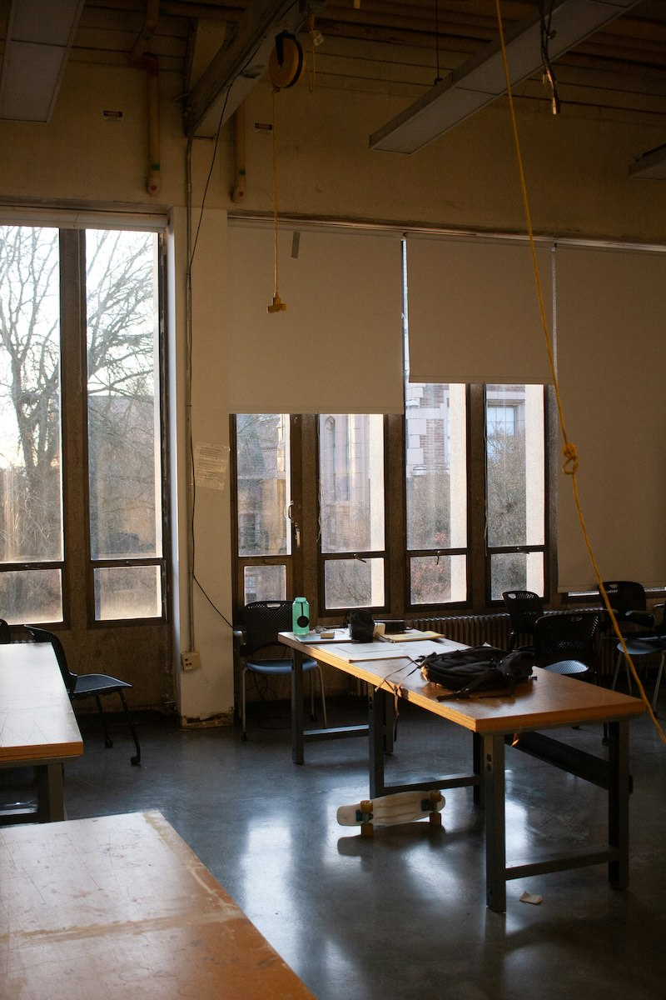
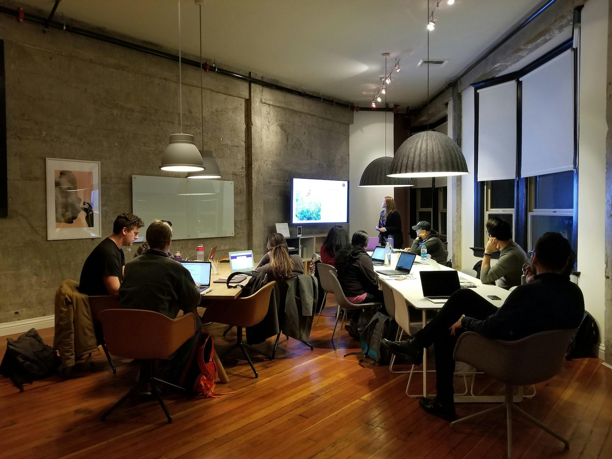
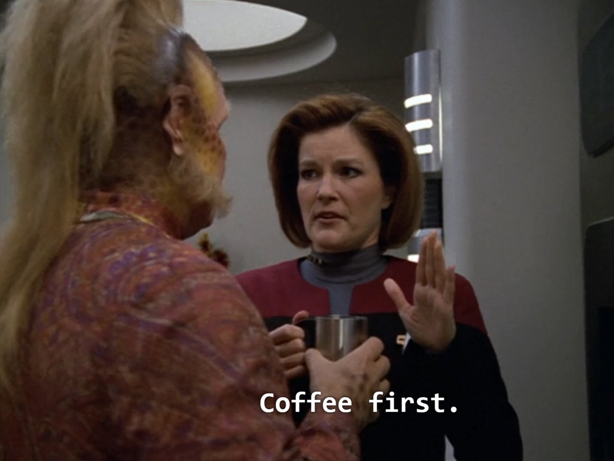

## Acknowledgement of Country

{ width=70% }

## What are the goals for today?

Admin and Strategies:

- Admin: hours, payslips, timetables, who to ask about what
- Knowledge: what is teaching about anyway?
- Strategies: facilitating labs, marking and feedback, inclusive teaching

_Acknowledgements:_ Many slides here created by members of the former ANU Centre for Learning and Teaching.

## Schedule

- 09:30: 1. How to be a tutor
- 11:00: Morning Tea
- 11:30: 2. Facilitating Classes
- 13:00	Lunch
- 13:30: 3. Feedback and Marking
- 15:00: Afternoon Tea
- 15:30: 4. Inclusive Teaching
- 17:00: Finish

# How to be a tutor

{width=50%}

## Task: Journey as an educator (5mins)

:::::::::::::: {.columns}
::: {.column width="60%"}
Everybody here has experience as a **learner** but this might be the start of your journey as an **educator**.

Or you might have had some experiences before... (maybe not as a job!)

_Examples:_ piano teaching kids, coaching soccer team, homework help for high-schoolers, leading a club or society  

**Who here has had a teaching experience before?**

We will discuss examples from the room.
:::
::: {.column width="40%"}

:::
::::::::::::::

## Charles' Teaching Journey

- 2003: (in highschool): helping out percussionists in junior concert band
- 2005: First work as a private percussion/drumset teacher
- 2007: (maybe?): Tutor for MATH1013/14 at ANU (!)
- 2014-2016: Tutor and Casual Lecturer at ANU (COMP1720, MUSI3309, COMP2100, COMP2300)
- 2019: Lecturer at ANU (COMP2300/6300, COMP1720/6720, COMP4350/8350)
- 2022: Developed study programs for Human Centred and Creative Computing (HCCC-MAJ, HCCC-MIN, HCCC-SPEC, HCCM-SPEC)
- 2025: Training new CSAs, teaching COMP3900/6390.
- 2026: ....????

## What's tutoring like?

- **Teaching labs:** standing at the front speaking to a whole class, helping individuals with work, answering questions, listening to problems and issues, helping students learn!
- **Marking assessments:** evaluating work (what have students learned?), explaining evaluations, writing feedback, explaining reasoning
- **Meeting with course convenors and other tutors:** going to meetings, understanding duties and tasks, providing ideas/info, incorporating feedback
- **Filling in timesheets, doing admin:** navigating ANU websites, understanding rights/responsibilities at work, asking for help

## Qualifications for teaching

> Why did I have to fill in a `docx` form?

HESF (Higher Education Standards Framework) expects universities to have teachers with one degree higher than the taught curriculum.
Some level of professional equivalency allowed given they have **supervision** and **professional development** (PD), e.g.,  

- PhD students allowed to teach master students
- undergrads may teach undergrads provided they have achieved excellent results in the subject
- Other examples, see [ANUP_016608 S28 Table 2](https://policies.anu.edu.au/ppl/document/ANUP_016608)

These rules are not new, but CSS is coming into compliance.

This semester, we learned that the `.docx` form is unhelpful, ongoing process to replace this.

Professional development: training at the start 😇, refresher session every year 👩🏽‍🏫

## Timesheets, hours, and earnings codes

Every two weeks you will need to fill in a timesheet on HORUS (the ANU HR website). 
Tricky because of way ANU accounts for teaching hours through "earnings codes" where 1 unit of the code may include more than 1 hour of work.

- T42: Marking: 1-to-1 ratio
- T44: "Other required activity": 1-to-1 ratio
- T21: **Teaching** "Supplementary / scaffolded form of delivery" (that is, tutorials or labs): 1-to-3 ratio (1 hour teaching + 2 hours of "associated working time")
- T23: **Repeat Teaching** "Supplementary / scaffolded form of delivery" (1 hour teaching + 1 hour associated working time)

Source: [ANU Academic Casual Sessional Rates](https://services.anu.edu.au/human-resources/salaries-benefits/academic-casual-sessional-rates)

## What is associated working time?

ANU Enterprise Agreemtns [S2.5---S2.6](https://services.anu.edu.au/human-resources/enterprise-agreement/schedule-2-casual-sessional-academic-activities-and-rates)

- Preparing of teaching activities
- Contemporaneous marking
- Administration directly associated with a teaching activity
- Face to face consultation immediately prior to and following a face to face teaching activity
- Online consultation (e.g. email, messages, forums) immediately prior to and following an online teaching activity
- Attendance at meetings specifically for the purpose of assisting the CSA staff member to prepare for their teaching activity

## Why do we do it this way?

- It's in the Enterprise Agreement
- Provides guarantees of hours throughout the semester
- Protects casual staff against unfair requests from academics (e.g., "You'll have to attend the lecture to find out what to teach! No you don't get paid for that!!")
- Provides an automatic allowance for preparation, Q&A and admin work. 

**Your manager** needs to provide tasks for you to complete in Associated Working Time.

## A worked example:

- Charles the tutor teaches two 1.5-hour labs, 3 hours of work (preparation, marking, admin, consultation and meetings) related to those labs, 
- 3 hours of marking assignments, 
- and 1 hour writing test cases for the exam.

| **Code** | **Units** | **Teaching Time** | **Associated Working Time** | **Total Hours Worked/Paid** |
|---|---|---|---|---|
| T21 Teaching | 1.5 | 1.5 | 3 | 4.5 |
| T23 Repeat Teaching | 1.5 | 1.5 | 1.5 | 3 |
| T42 Marking | 3 |  |  | 3 |
| T44 Other | 1 |  |  | 1 |

## School of Computing: 1.5 + 0.5 structure

In the School of Computing, many of our classes have a 1.5 hour teaching + 0.5 hour drop-in individual consulting structure.

- Computer Lab: 1.5 hours (T21/23 teaching)
- Drop-in: 0.5 hours (taken from the associated hours)

**Charles advice**:

- At the end of 1.5 hours announce "the tutorial is now over, I am staying until X o'clock to answer individual questions."
- Answer questions about any aspect of the course (redirect problem questions to the forum and help the student to write and submit the post). 
- Don't do any **group teaching** in consultation time.

## Submitting your timesheet

:::::::::::::: {.columns}
::: {.column width="50%"}
Submit your timesheet **on time**. (please!!) 

- Suggested submit date is the [last Sunday in each two-week pay period](https://services.anu.edu.au/information-technology/software-systems/hr-online-remote-user-system/timesheet-approval-cut-off). Actual due date _can change_ due to public holidays.
- And **double check that you get paid!**
- [Timesheets FAQ](https://services.anu.edu.au/information-technology/software-systems/hr-management-system/casual-academic-timesheets-faqs)
:::
::: {.column width="50%"}

:::
::::::::::::::

## Safety: What to do if something bad happens?

⚠️⚠️⚠️ Threats of [harassment, bullying, violence (interpersonal, psychological, sexual or physical) or disrupting classes completely](https://policies.anu.edu.au/ppl/document/ANUP_6097481) not acceptable---and not your job to resolve! ⚠️⚠️⚠️

**Prioritise your safety. Just walk out.**

1. You are in control of your class, if you feel unsafe **walk out!**
2. go to a **safe place** (e.g., CSIT Front Office)
3. call **ANU security**: **61252249** or [ANUOK App](https://services.anu.edu.au/campus-environment/safety-security/anuok-app)

## Emergency Buttons and Phones

- CSIT labs have a **red panic button** on the wall near the door: ANU Security will visit immediately if the button is pressed.
- Life threatening emergency call **000** from your phone or **0000** from an ANU Phone, then call ANU Security **61252249** (**52249** from internal phone).

Link: [ANU Safety Website](https://services.anu.edu.au/campus-environment/safety-security)

## Where to get help 

:::::::::::::: {.columns}
::: {.column width="50%"}
- Other tutors: course team / communication channels (varies by course)
- Course Convenor (your direct manager)
- School of Computing front desk (CSIT Level 3 or <admin.comp@anu.edu.au>)
- Peter Hoefner - Associate Director (Education) in School of Computing: <adir.education.comp@anu.edu.au>
- **me** - Assistant to the above - also <adir.education.comp@anu.edu.au>
:::
::: {.column width="50%"}

:::
::::::::::::::

## Working with convenors

Communicate:

- Your convenor is your main "boss" and contact point for your job. 
- You will need to learn about how they operate.
- Dynamic can change! Work _instructions_ are different to learning _suggestions_: e.g., how much time to spend on a task.

Listen, observe, be understanding:

- Academics are... all really **different**!
- Convenors can get **stressed**: budgets, plagiarism, appeals, marking, deadlines and this is only 40% of our job!
- If you aren't getting a reply consider: Are they trying to write their book? Are they at a conference?

# Developing as an educator

{width=40%}

## Am I expected to know everything on the first day?

:::::::::::::: {.columns}
::: {.column width="50%"}
Of course not!

- Teaching is a craft, we learn by doing.
- As a tutor you have a well-defined role, lots of resources, and support.
- Not expected to be perfect on day 1, or even day 100.

We're going to talk about developing as an educator.
:::
::: {.column width="50%"}
{width=50%}
:::
::::::::::::::

## Task: Getting to know you as a learner (5mins)

:::::::::::::: {.columns}
::: {.column width="60%"}
Reflect on your teaching experiences, expectations and learning needs.

Select three sticky notes from your table and answer these three questions:

- What **do you enjoy** or **expect to enjoy** about tutoring?
- What challenges **have you faced** or do you **expect to face** as a tutor?
- What aspects of tutoring would you most like support with?

Discuss with your group and then we'll hear one example of each question from each table.
:::
::: {.column width="40%"}

:::
::::::::::::::

## How do people develop as teachers?

@kugel_how_professors_develop_as_teachers describes one pathway of development as university teachers:

- Self
- Subject
- Student...

As educators we also learn and are influenced by our environment, experiences, and self.

## Phase 1: Emphasis on Teaching

:::::::::::::: {.columns}
::: {.column width="60%"}
1. **Focus on self**: Survival in front of a class! Learning how to explain, fear of not knowing the "right" answers.
2. **Focus on subject**: Covering the topic thoroughly (more than a student!). Preparing packaged, inspiring, and interesting content.  Fear of running out of time!
3. **Focus on student**: Students are different! Prepare alternatives formulas and explanations. Learn about student needs, awareness of multiple valid approaches.
:::
::: {.column width="40%"}

:::
::::::::::::::

## Phase 2: Emphasis on Learning

:::::::::::::: {.columns}
::: {.column width="60%"}
4. **Student as active**: Let students do the work! Coaching students in applied learning activities. Teaching less, but more learning occurs.
5. **Student as independent**: Coach students in learning how to learn. Let students independently explore. (What knowledge will be important in computing in 20 years?)
6. **Tuning**: Established skills in previous stages. Move between stages as necessary, updating and experimenting.
:::
::: {.column width="40%"}

:::
::::::::::::::

## Risks

Early stages:

- Great content, students not engaging and not learning.
- Overwhelm students with explanations: answering questions not asked.
- Frustrating when student don't find this fascinating topic interesting!

Later stages:

- Getting students to **do** things: tricky.
- Teaching _less_ doesn't mean _nothing_: still need telling/showing (explicit teaching).
- Need to do _listening_ and _questioning_: these are hard skills.
- Students annoyed! "Just tell me what to do!!"

## Task: What stages resonates for you?

:::::::::::::: {.columns}
::: {.column width="60%"}
Think about the phases/stages of teaching described in @kugel_how_professors_develop_as_teachers

- Focus on self
- Focus on subject
- Focus on student
- Student as active
- Student as independent
- Tuning

> What stages resonate for you and why? Where are you on your teaching journey?

Discuss in your groups and we will come together to hear some responses.
:::
::: {.column width="40%"}

:::
::::::::::::::

# Questions: Who has a question?

:::::::::::::: {.columns}
::: {.column width="60%"}
**Who has a question?**

_It's time for a break so we can remember questions for when we come back or for discussion over coffee..._

:::
::: {.column width="40%"}

:::
::::::::::::::

# References {.allowframebreaks}
