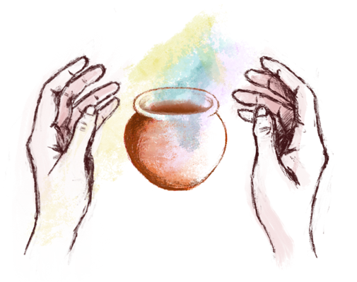

## Acknowledgement of Country

{ width=70% }

## What are the goals for today?

Admin and Strategies:

- Admin: hours, payslips, timetables, who to ask about what
- Knowledge: what is teaching about anyway?
- Strategies: facilitating labs, marking and feedback, inclusive teaching

_Acknowledgements:_ Many slides here created by members of the former ANU Centre for Learning and Teaching.

## Schedule

- 09:30	1. How to be a tutor
- 11:00	Morning Tea
- 11:30	2. Facilitating Classes
- 13:00	Lunch
- 13:30	3. Feedback and Marking
- 15:00	Afternoon Tea
- 15:30	4. Inclusive Teaching
- 17:00	Finish

# How to be a tutor

## Task: Journey as an educator (5mins)

Everybody here has experience as a **learner** but this might be the start of your journey as an **educator**.

Or you might have had some experiences before... (maybe not as a job!)

_Examples:_ piano teaching kids, coaching soccer team, homework help for high-schoolers, leading a club or society  

**Who here has had a teaching experience before?**

## Charles' Teaching Journey

- 2003: (in highschool): helping out percussionists in junior concert band
- 2005: First work as a private percussion/drumset teacher
- 2007: (maybe?): Tutor for MATH1013/14 at ANU (!)
- 2014-2016: Tutor and Casual Lecturer at ANU (COMP1720, MUSI3309, COMP2100, COMP2300)
- 2019: Lecturer at ANU (COMP2300/6300, COMP1720/6720, COMP4350/8350)
- 2022: Developed study programs for Human Centred and Creative Computing (HCCC-MAJ, HCCC-MIN, HCCC-SPEC, HCCM-SPEC)
- 2025: New this year! Training new CSAs, teaching COMP3900/6390.

<!-- ## Teaching Values

I'm a Senior Fellow of the Higher Education Academy where we follow a [Professional Standards Framework](https://www.advance-he.ac.uk/teaching-and-learning/psf); one part of this is 5 _values_:

- **V1**: respect individual learners and diverse groups of learners
- **V2**: promote engagement in learning and equity of opportunity for all to reach their potential
- **V3**: use scholarship, or research, or professional learning, or other evidence-informed approaches as a basis for effective practice
- **V4**: respond to the wider context in which higher education operates, recognising implications for practice
- **V5**: collaborate with others to enhance practice

Talking to you is in accordance with these values! -->

## What's tutoring like?

- **Teaching labs:** standing at the front speaking to a whole class, helping individuals with work, answering questions, listening to problems and issues, helping students learn!
- **Marking assessments:** evaluating work (what have students learned?), explaining evaluations, writing feedback, explaining reasoning
- **Meeting with course convenors and other tutors:** going to meetings, understanding duties and tasks, providing ideas/info, incorporating feedback
- **Filling in timesheets, doing admin:** navigating ANU websites, understanding rights/responsibilities at work, asking for help

## Timesheets and hours

Every two weeks you will need to fill in a timesheet on HORUS (the ANU HR website). You won't get paid until you fill in the timesheet and your manager (course convenor) approves it!

Tricky because of way ANU accounts for teaching hours through "earnings codes" where 1 unit of the code may include more than 1 hour of work.

- T42: Marking: 1-to-1 ratio
- T44: "Other required activity": 1-to-1 ratio
- T21: **Teaching** "Supplementary / scaffolded form of delivery" (that is, tutorials or labs): 1-to-3 ratio (1 hour teaching + 2 hours of "associated working time")
- T23: **Repeat Teaching** "Supplementary / scaffolded form of delivery" (1 hour teaching + 1 hour associated working time)

Source: [ANU Academic Casual Sessional Rates](https://services.anu.edu.au/human-resources/salaries-benefits/academic-casual-sessional-rates)

## What is associated working time?

[S2.5---S2.6](https://services.anu.edu.au/human-resources/enterprise-agreement/schedule-2-casual-sessional-academic-activities-and-rates)

- Preparing of teaching activities
- Contemporaneous marking
- Administration directly associated with a teaching activity
- Face to face consultation immediately prior to and following a face to face teaching activity
- Online consultation (e.g. email, messages, forums) immediately prior to and following an online teaching activity
- Attendance at meetings specifically for the purpose of assisting the CSA staff member to prepare for their teaching activity

## Why do we do it this way?

- It's in the Enterprise Agreement
- Provides guarantees of hours throughout the semester
- Protects casual staff against unfair requests from academics (e.g., "You'll have to attend the lecture to find out what to teach! No you don't get paid for that!!")

## Example:

- In one week, Charles the tutor teaches two 2-hour labs and 6 hours of preparation, marking, admin, consultation and meetings related to those labs.
- He also does 3 hours of marking assignments and 1 hour writing test cases for the exam.

| Code | Units | Teaching Time | Associated Working Time | Actual Hours Work/Pay |
|---|---|---|---|---|
| T21 Teaching | 2 | 2 | 4 | 6 |
| T23 Repeat Teaching | 2 | 2 | 2 | 4 |
| T42 Marking | 3 |  |  | 3 |
| T44 Other | 1 |  |  | 1 |

## Safety: What to do if something bad happens?

Threats of [harassment, bullying, violence (interpersonal, psychological, sexual or physical) or disrupting classes completely](https://policies.anu.edu.au/ppl/document/ANUP_6097481) not acceptable---and not your job to resolve!

**Prioritise your safety. Just walk out.**

1. You are in control of your class, if you feel unsafe **walk out!**
2. go to a **safe place** (e.g., CSIT Front Office)
3. call **ANU security**: **61252249**

## Emergency Buttons and Phones

- CSIT labs have a **red panic button** on the wall near the door: ANU Security will visit immediately if the button is pressed.
- Life threatening emergency call **000** from your phone or **0000** from an ANU Phone, then call ANU Security **61252249** (**52249** from internal phone).

## Where to get help 

- Other tutors: course team / communication channels (varies by course)
- Course Convenor (your direct manager)
- School of Computing front desk (CSIT Level 3 or <admin.comp@anu.edu.au>)
- Peter Hoefner - Associate Director (Education) in School of Computing: <peter.hoefner@anu.edu.au>

## Working with convenors

Communicate:

- Your convenor is your main "boss" and contact point for your job. 
- You will probably meet with them (and your co-tutors) regularly and need to learn about how they operate.
- Dynamic can change! Work _instructions_ are different to learning _suggestions_: e.g., how much time to spend on a task.

Listen, observe, be understanding:

- Academics are... all really **different**!
- Convenors can get **stressed**: budgets, plagiarism, appeals, marking, deadlines and this is only 40% of our job!
- If you aren't getting a reply consider: Are they trying to write their book? Are they at a conference?

# Developing as an Educator

## Am I expected to know everything on the first day?

Of course not!

- Teaching is a craft, we learn by doing.
- As a tutor you have a well-defined role, lots of resources, and support.
- Not expected to be perfect on day 1, or even day 100.

We're going to talk about developing as an educator.

## Task: Getting to know you as a learner (5mins)

Reflect on your teaching experiences, expectations and learning needs.

Select three sticky notes from your table and answer these three questions:

- What __do you enjoy__ or __expect to enjoy__ about tutoring?
- What challenges __have you faced__ or do you __expect to face__ as a tutor?
- What aspects of tutoring would you most like support with?

Discuss with your group and then we'll hear one example of each question from each table.

## How do people develop as teachers?

[Kugel (1993)](https://doi.org/10.1080/03075079312331382241) describes one pathway of development as university teachers:

- Self
- Subject
- Student...

As educators we also learn and are influenced by our environment, experiences, and self.

Citation: Peter Kugel (1993) How professors develop as teachers, Studies in Higher
Education, 18:3, 315-328, DOI: [10.1080/03075079312331382241](https://doi.org/10.1080/03075079312331382241)

## Phase 1: Emphasis on Teaching

{width=40%}

1. **Focus on self**: Survival in front of a class! Learning how to explain, fear of not knowing the "right" answers.
2. **Focus on subject**: Covering the topic thoroughly (more than a student!). Preparing packaged, inspiring, and interesting content.  Fear of running out of time!
3. **Focus on student**: Students are different! Prepare alternatives formulas and explanations. Learn about student needs, awareness of multiple valid approaches.

## Phase 2: Emphasis on Learning

{width=40%}

4. **Student as active**: Let students do the work! Coaching students in applied learning activities. Teaching less, but more learning occurs.
5. **Student as independent**: Coach students in learning how to learn. Let students independently explore. (What knowledge will be important in computing in 20 years?)
6. **Tuning**: Established skills in previous stages. Move between stages as necessary, updating and experimenting.

## Risks

Early stages: 

- Great content, students not engaging and not learning.
- Overwhelm students with explanations: answering questions not asked.
- Frustrating when student don't find this fascinating topic interesting!

Later stages:

- Getting students to **do** things: tricky.
- Teaching _less_ doesn't mean _nothing_: still need telling/showing (explicit teaching).
- Need to do _listening_ and _questioning_: these are hard skills.
- Students annoyed! "Just tell me what to do!!"

# Theories of teaching

## What do you mean by teaching?

Knowing what teaching **is** can be tricky!

[Fox’s (1983) "Personal Theories of Teaching"](https://doi.org/10.1080/03075078312331379014) offers metaphors for different ways that teaching happens.

Citation: Fox, D. (1983). Personal theories of teaching. Studies in Higher Education, 8(2), 151–163. DOI: [10.1080/03075078312331379014](https://doi.org/10.1080/03075078312331379014)

## Transfer Theory

__The teacher is like a fountain of knowledge.__

- The teacher transfers knowledge to the learner who “receives” it.
- Learners are passive and have very little autonomy in their learning.
- The teacher presents, instructs, transfers, transmits and conveys learning.
- Often found in lectures, presentations, seminars, reading lists and study notes etc.

## Shaping Theory

__The teacher is like a craftsperson or a sculptor.__ 

- The teacher shapes and “moulds” knowledge in the learner.
- Learners have limited autonomy in their learning.
- The teacher demonstrates, instructs, coaches and develops learning.
- Often found in lectures, labs and practicals, workshops etc.

## Building Theory

__The teacher is like an architect, draftsperson or city planner.__

- A hybrid of transfer and shaping.
- The teacher provides the "materials” and “plans” for the learners to build from.
- Learners have more autonomy to apply knowledge and skills to achieve predetermined outcomes.
- The teacher instructs, enables, directs and structures learning.
- Often found in lectures, labs and practicals, workshops etc.

## Travelling Theory

__The teacher is like an expert guide.__

- Learning is a journey of exploration facilitated by the teacher.
- Learner has a high degree of autonomy in navigating their learning path.
- Teacher monitors, guides, facilitates, and enables learning. They point the way.
- Often found in problem and project-based learning, research projects etc.

## Growing Theory

__The teacher is like a gardener.__

- The learner produces knowledge through exploration and discovery.
- Learners have the autonomy to actively define their own learning path.
- The teacher encourages, promotes, cultivates and nurtures learning.
- Often found in self-directed learning, problem and project-based learning etc.
- An on-going, evolving process.

## Task: What do these mean to us? (2mins)

These are _metaphors_ for the dynamics between students and teachers, not intended to be universal!

- Which of these approaches have you experienced?
- What was the context and how did it affect learning?
- Which of these approaches do you think are relevant to your own teaching?

## Applying theory to practice

Imagine you are a tutor for COMP1100 teaching your students how to write recursive functions in Python.

- In the teaching materials, you find  __5 activity designs:__
- You examine each activity and its teaching approach.
- Thinking back on  __Fox’s Theories of Teaching,__  you decide to match _each activity_  to  _one_ of Fox’s metaphors.

Go to Charles' PollEverywhere to match activities to metaphors: <PollEv.com/charlesmarti205>

## Approach A: Methods and Questions

The tutor explains initial concept and demonstrates a prescribed method to write recursive functions.

- The tutor presents some basic examples.
- The tutor provides a method to solve similar examples.

The tutor points students to resources on the course website to help solve more complex problems.

- The students solve set problems from the lab webpage using the resources provided by the tutor.

Some students solve the problems quickly and find them too easy

- The tutor asks them to find more challenging questions to attempt but allows them to leave early.

## Approach B: Activity Stations

The tutor sets out a series of recursive function resources and problems across several tables that become more complex and challenging. 

- Students self-diagnose which activity station they should be at. They can stay at any station as long as they want and can move at any time.
- The tutor encourages group work and moves around the room helping students who get stuck.

## Approach C: Steps

The tutor presents the following steps on the whiteboard.

1. Write a function definition
2. Determine the base case for function and return the answer to that first.
3. Determine the recursive case for the function and call the function from inside itself (more than once if needed).
4. Test your function with different inputs.
5. If necessary, update your function so that the outputs are correct.

The students complete practice problems from the lab webpage. 

## Approach D: Visualisation

The tutor explains the concept of recursion by visualising a recursive datatype. The tutor shows the following image on the board and explains how count the number of people in the list recursively:

](img/recursive-line-datatype.jpg){ width=40% }

- The tutor provides recursion problems to solve by using visualisation. The tutor moves around the room checking the students’ work.
- When the students have understood the concept, the tutor shows on the board how to answer these types of questions _without_ the visualisation.

## Approach E: Working in Groups

The tutor asks students to work in groups to solve recursion problems on the lab webpage.

{ width=40% }

- The tutor moves ensures that students work on problems at the right level to them, grouping students of similar levels together.
- The tutor looks out moments when students are ready for harder problems, points to advanced techniques.
- If students are finished quickly, the tutor has challenging problems ready, or asks them to help others.

## Task: What activity resonates for you? (5min)

- **Transfer:** presents, instructs, transfers, transmits and conveys learning.
- **Shaping:** demonstrates, instructs, coaches and develops learning.
- **Building:** instructs, enables, directs and structures learning.
- **Travelling:** monitors, guides, facilitates, and enables learning. They point the way.
- **Growing:** encourages, promotes, cultivates and nurtures learning.

What activity would you most like to do as a student? Can you see any problems with how the activities are planned?

Let's discuss together.

## Applying theory to practice

- No single approach is “correct”. Each has its purpose and context. They are all integral to effective teaching practice.
- No approach is “singular”. They are used in combination in various ways and often occur at the same time in different contexts or at different levels of learning.
- No approach is “universal”. In each class, there will be learners with their own individual learning needs. Your teaching approach should be responsive, adaptive and inclusive.

"Everything works somewhere; nothing works everywhere."
