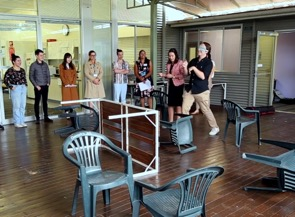

# Facilitating Learning

## Task: Your Tutorial Experiences (5mins)

Think of a time you had:

- a good tutorial experience
- a disappointing tutorial experience

Discuss with your group and find one example of each (one good, one bad) to share.

## Facilitating Learning!

This is really the main job of a **tutor**. (or is it?)

- You're in a classroom full of motivated students
- There's materials and activities for your class prepared
- There's learning outcomes to meet

How do we get the students to _learn_?

Let's look at _facilitation_ as a strategy and skill for you to have in your teaching.

## Approaches to learning

{width=40%}

You are going to a [video (link)](https://vimeo.com/506981439/3fcaf2ac8c) demonstrating a learning activity. 

- What is the objective of the activity?
- What does the learner have to do?
- What are the rules and conditions?

## Thinking about roles

Let's think about what was happening.

- Why is the educator called _an instructor_ in the first example?
- Why is the educator called _a facilitator_ in the second example?
- What specifically does educator _do_ in each example?
- How _effective_ do you think each approach is?

## Task thinking about the activity (5min)

Which approach do you think:

- Is quicker?
- Requires more preparation?
- Allows more learner autonomy?
- Enables the learner to apply their learning?
- Promotes deeper learning?
- Provides a more engaging experience?

Discuss in your group, and we'll discuss together in a few minutes.

## Asking questions

Consider the facilitation questions that were used in the video.

- Why were you reaching out in front of you?
- What would you do if I weren’t here?
- What do you need to do in this activity?
- Is there anything I can give you to help you?
- What would you like me to do?
- How do you know you’re going the right way?
- Where are you trying to get to?
- Can you show us what you might do with the umbrella?
- What’s underneath you? What are you standing on? Could you use that to help you?
- How would you make adjustments so you’re not tripping over anything?

## Asking questions

Facilitation questions can be used to:

- Prompt thinking and ideas
- Check understanding
- Share information with the class
- Encourage discussion
- Promote critical thinking

Resource: [asking questions to support learning](https://melbourne-cshe.unimelb.edu.au/__data/assets/pdf_file/0006/3637923/asking-questions-to-support-student-learning_final.pdf)

## Task: Facilitating a learning activity (15mins).

Soon you are going facilitate an activity to solve a puzzle on your own.

You'll need groups of three, and we will do this three times so that **everybody** gets to be the facilitator.

- Round 1: Dog Puzzle
- Round 2: Rope Puzzle
- Round 3: Question Puzzle

In each group, one person will be **student**, one **facilitator** and one **observer**. Switch after each round.

## Roles

- **Student**: needs to solve the problem (or make some progress), unfortunately, you really have no idea how to accomplish this by yourself.
- **Facilitator**: needs to use facilitation questions to help the student solve the problem.
- **Observer**: needs to evaluate the facilitation going on. How much are the questions helping, how much are we hearing from the student?

At the end of each turn, the observer provides peer feedback to the facilitator to improve.

## Dog Puzzle

How did the dog cross the river?

- A man stands on one side of a river, his dog on the other. 
- The man calls his dog, who immediately crosses the river without getting wet and without using a bridge or a boat. 

## Rope Puzzle

- You have 2 ropes coated in oil to help them burn.
- The ropes burn at constant rates, and each rope will take _exactly 1 hour_ to burn all the way through.
- With only a lighter to ignite the ropes, how can you measure exactly 45 minutes? 

## Question Puzzle

- I can break, I can get clogged, I can be attacked, I can be given, I can be kept, I can be crushed. Yet, I can be whole at the same time.

<!-- ## The Goat Problem

- Imagine a circular fence enclosing an acre of grass. A [goat](https://www.quantamagazine.org/after-centuries-a-seemingly-simple-math-problem-gets-an-exact-solution-20201209/) is inside the fence, tied to a post. 
- How long does the rope have to be so that the goat can eat half the grass? -->

# Challenges and Tips for Facilitation

## Dealing with challenges

What might you do when...

- You realise your question or prompt was unclear or confusing for the student(s)?
- The student’s response is unclear?
- No one volunteers a response?
- The same student(s) keeps answering all the questions?
- Certain students never respond?
- The student’s response is not correct or what you expected?

## Task: Questioning in Computing Labs (5mins)

Based on your experience as a learner, how can questioning be used in computing labs or your tutorials?

- Come up with three examples with your group.
- Choose one to share with the room.

## Coding Class Applications

Solving a coding problem can feel a bit like walking around blindfolded!

- We can use questioning to _slow_ down trying to "solve" the problem, identify resources, look for feedback, unblock thinking.
- "Is there a resource we can use to help with this problem?"
- "Is this a problem you've seen before?"
- "What is the computer telling you"
- "Is there anything you could change to find out what's happening?"
- "Where does the computer start with this code?"

Question: Does this conflict with _explicit teaching_?

## Facilitating effectively:

- "Ask, don’t tell."
- Design meaningful learning activities.
- Provide clear expectations, goals and desired outcomes.
- Consider what information students need and when.
- Create and provide a supportive learning environment.
- Engage students’ prior knowledge.
- Encourage the learner to **analyse** problems, **offer** solutions and **think for themselves**.
- Enable regular **reflection** on content, tasks and own learning.
- Connect current learning with future challenges and tasks.

## Questioning techniques

- Effective questioning is a skill that requires practice.
- Consider the purpose of your question.
- Plan specific questions or question sequences before class.
- Keep questions as simple as possible.
- Be prepared to clarify or rephrase your questions.
- Be supportive in responding to questions.
- Be mindful of students' feelings.
