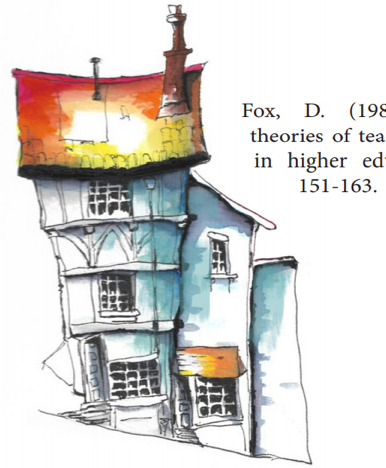
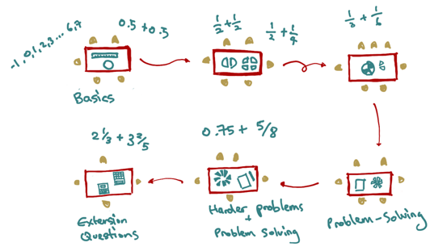

# Theories of teaching

{width=50%}

## What do you mean by teaching?

Knowing what teaching **is** can be tricky!

@fox_personal_theories_of_teaching ["Personal Theories of Teaching"](https://doi.org/10.1080/03075078312331379014) offers metaphors for different ways that teaching can happen:

> Transfer, Shaping, Building, Traveling, Growing

{width=70%}

## Transfer Theory

:::::::::::::: {.columns}
::: {.column width="50%"}
**The teacher is like a fountain of knowledge.**

- The teacher transfers knowledge to the learner who "receives" it.
- Learners are passive and have very little autonomy in their learning.
- The teacher presents, instructs, transfers, transmits and conveys learning.
- Often found in lectures, presentations, seminars, reading lists and study notes etc.
:::
::: {.column width="50%"}
{width=80%}
:::
::::::::::::::

## Shaping Theory

:::::::::::::: {.columns}
::: {.column width="50%"}
**The teacher is like a craftsperson or a sculptor.** 

- The teacher shapes and "moulds" knowledge in the learner.
- Learners have limited autonomy in their learning.
- The teacher demonstrates, instructs, coaches and develops learning.
- Often found in lectures, labs and practicals, workshops etc.
:::
::: {.column width="50%"}
{width=80%}
:::
::::::::::::::

## Building Theory

:::::::::::::: {.columns}
::: {.column width="50%"}
**The teacher is like an architect, or city planner.**

- A hybrid of transfer and shaping.
- The teacher provides the "materials" and "plans" for the learners to build from.
- Learners have more autonomy to apply knowledge and skills to achieve predetermined outcomes.
- The teacher instructs, enables, directs and structures learning.
- Often found in lectures, labs and practicals, workshops etc.

:::
::: {.column width="50%"}
{width=60%}
:::
::::::::::::::

## Travelling Theory

:::::::::::::: {.columns}
::: {.column width="50%"}
**The teacher is like an expert guide.**

- Learning is a journey of exploration facilitated by the teacher.
- Learner has a high degree of autonomy in navigating their learning path.
- Teacher monitors, guides, facilitates, and enables learning. They point the way.
- Often found in problem and project-based learning, research projects etc.

:::
::: {.column width="50%"}
{width=80%}
:::
::::::::::::::

## Growing Theory

:::::::::::::: {.columns}
::: {.column width="50%"}
**The teacher is like a gardener.**

- The learner produces knowledge through exploration and discovery.
- Learners have the autonomy to actively define their own learning path.
- The teacher encourages, promotes, cultivates and nurtures learning.
- Often found in self-directed learning, problem and project-based learning etc.
- An on-going, evolving process.
:::
::: {.column width="50%"}
{width=60%}
:::
::::::::::::::

## Task: What do these mean to us? (2mins)

{width=70%}

- Which of these approaches have you experienced?
- What was the context and how did it affect learning?
- Which of these approaches do you think are relevant to your own teaching?

## Applying teaching theories

Imagine you are a tutor for COMP1200 teaching your students how to write recursive functions in C.

- In the teaching materials, you find  **5 activity designs:**
- You examine each activity and its teaching approach.
- Thinking back on  **Fox's Theories of Teaching,**  you decide to match _each activity_  to  _one_ of Fox's metaphors.

Go to Charles' PollEverywhere to match activities to metaphors: <https://PollEv.com/charlesmarti205>

## Approach A: Methods and Questions

The tutor explains initial concept and demonstrates a prescribed method to write recursive functions.

- The tutor presents some basic examples.
- The tutor provides a method to solve similar examples.

The tutor points students to resources on the course website to help solve more complex problems.

- The students solve set problems from the lab webpage using the resources provided by the tutor.

Some students solve the problems quickly and find them too easy

- The tutor asks them to find more challenging questions to attempt but allows them to leave early.

## Approach B: Activity Stations

:::::::::::::: {.columns}
::: {.column width="50%"}
The tutor sets out a series of recursive function resources and problems across several tables that become more complex and challenging. 

- Students self-diagnose which activity station they should be at. They can stay at any station as long as they want and can move at any time.
- The tutor encourages group work and moves around the room helping students who get stuck.
:::
::: {.column width="50%"}
{width=90%}
:::
::::::::::::::

## Approach C: Steps

The tutor presents the following steps on the whiteboard.

1. Write a function definition
2. Determine the base case for function and return the answer to that first.
3. Determine the recursive case for the function and call the function from inside itself (more than once if needed).
4. Test your function with different inputs.
5. If necessary, update your function so that the outputs are correct.

The students complete practice problems from the lab webpage. 

## Approach D: Visualisation

:::::::::::::: {.columns}
::: {.column width="50%"}
The tutor shows this image on the board and explains how count the number of people in the list recursively.

- The tutor provides recursion problems to solve using visualisation. The tutor moves around the room checking the students' work.
- When the students have understood the concept, the tutor shows on the board how to answer these types of questions _without_ the visualisation.
:::
::: {.column width="50%"}
](img/recursive-line-datatype.jpg){ width=90% }
:::
::::::::::::::

## Approach E: Working in Groups

:::::::::::::: {.columns}
::: {.column width="50%"}
The tutor puts students in groups to solve recursion problems on the lab webpage.

- The tutor groups students of similar levels together.
- The tutor looks out for moments when students are ready for harder problems pointing to advanced techniques.
- If students are finished quickly, the tutor has challenging problems ready, or asks them to help others.
:::
::: {.column width="50%"}
{ width=95% }
:::
::::::::::::::

## Which theory is best?

> "Everything works somewhere; nothing works everywhere."

- No single approach is _correct_. Each has its purpose and context. They are all integral to effective teaching practice.
- No approach is _singular_. They are used in combination in various ways and often occur at the same time in different contexts or at different levels of learning.
- No approach is _universal_. In each class, there will be learners with their own individual learning needs. Your teaching approach should be responsive, adaptive and inclusive.

## Task: What activity resonates for you? (5min)

:::::::::::::: {.columns}
::: {.column width="60%"}
- **Transfer:** presents, instructs, transfers, transmits and conveys learning.
- **Shaping:** demonstrates, instructs, coaches and develops learning.
- **Building:** instructs, enables, directs and structures learning.
- **Travelling:** monitors, guides, facilitates, and enables learning. They point the way.
- **Growing:** encourages, promotes, cultivates and nurtures learning.

> What activity would you most like to do as a student? Can you see any problems with how the activities are planned?

Let's discuss together.
:::
::: {.column width="40%"}

:::
::::::::::::::

# Facilitating Learning

<!-- ## Task: Your Tutorial Experiences (5mins)

Think of a time you had:

- a  good tutorial experience
- a disappointing tutorial experience

Discuss with your group and find one example of each (one good, one bad) to share. -->

## Facilitating Learning!

This is really the main job of a **tutor**. (or is it?)

- You're in a classroom full of motivated students
- There's materials and activities for your class prepared
- There's learning outcomes to meet

How do we get the students to _learn_?

Let's look at _facilitation_ as a strategy and skill for you to have in your teaching.

## Approaches to learning

:::::::::::::: {.columns}
::: {.column width="60%"}
You are going to a [video (link)](https://vimeo.com/506981439/3fcaf2ac8c) demonstrating a learning activity. 

- What is the objective of the activity?
- What does the learner have to do?
- What are the rules and conditions?
:::
::: {.column width="40%"}
{width=90%}
:::
::::::::::::::

## Thinking about roles

Let's think about what was happening.

- Why is the educator called _an instructor_ in the first example?
- Why is the educator called _a facilitator_ in the second example?
- What specifically does educator _do_ in each example?
- How _effective_ do you think each approach is?

## Asking questions

Consider the facilitation questions that were used in the video.

- Why were you reaching out in front of you?
- What would you do if I weren't here?
- What do you need to do in this activity?
- Is there anything I can give you to help you?
- What would you like me to do?
- How do you know you're going the right way?
- Where are you trying to get to?
- Can you show us what you might do with the umbrella?
- What's underneath you? What are you standing on? Could you use that to help you?
- How would you make adjustments so you're not tripping over anything?

## Facilitation Questions

Facilitation questions can be used to:

- Prompt thinking and ideas
- Check understanding
- Share information with the class
- Encourage discussion
- Promote critical thinking

Resource: [asking questions to support learning](https://melbourne-cshe.unimelb.edu.au/__data/assets/pdf_file/0006/3637923/asking-questions-to-support-student-learning_final.pdf) [@marangell_asking_questions_to_support_student_learning]

## Task: Thinking about questioning (5min)

:::::::::::::: {.columns}
::: {.column width="60%"}
Which approach do you think:

- Is quicker?
- Requires more preparation?
- Allows more learner autonomy?
- Have you experienced in your education?
- You would be more comfortable using?
- Provides a more engaging experience?

Discuss in your group, and we'll discuss together in a few minutes.
:::
::: {.column width="40%"}

:::
::::::::::::::

# Challenges and Tips for Facilitation

## Dealing with challenges

What might you do when...

- You realise your question or prompt was unclear or confusing for the student(s)?
- The student's response is unclear?
- No one volunteers a response?
- The same student(s) keeps answering all the questions?
- Certain students never respond?
- The student's response is not correct or what you expected?

> Which of these challenges have occurred already today?

## Task: Questioning in Computing Labs (5mins)

:::::::::::::: {.columns}
::: {.column width="60%"}
Based on your experience as a learner, how can questioning be used in computing labs or your tutorials?

- Come up with three examples with your group.
- Choose one to share with the room.

:::
::: {.column width="40%"}

:::
::::::::::::::

## Coding Class Applications

Solving a coding problem can feel a bit like walking around blindfolded!

- We can use questioning to _slow_ down trying to "solve" the problem, identify resources, look for feedback, unblock thinking.
- "Is there a resource we can use to help with this problem?"
- "Is this a problem you've seen before?"
- "What is the computer telling you"
- "Is there anything you could change to find out what's happening?"
- "Where does the computer start with this code?"

Question: Does this conflict with _explicit teaching_?

## Facilitating effectively

- "Ask, don't tell."
- Design meaningful learning activities.
- Provide clear expectations, goals and desired outcomes.
- Consider what information students need and when.
- Create and provide a supportive learning environment.
- Engage students' prior knowledge.
- Encourage the learner to **analyse** problems, **offer** solutions and **think for themselves**.
- Enable regular **reflection** on content, tasks and own learning.
- Connect current learning with future challenges and tasks.

## Questioning techniques

- Effective questioning is a skill that requires practice.
- Consider the purpose of your question.
- Plan specific questions or question sequences before class.
- Keep questions as simple as possible.
- Be prepared to clarify or rephrase your questions.
- Be supportive in responding to questions.
- Be mindful of students' feelings.

# Practicing Facilitation

Practice makes perfect so let's try some questioning on a few (potentially) tricky problems.

It's important to be able to use the skill of questioning even when **you** aren't sure of the "answer", or when an "answer" doesn't really exist.

(E.g., in PhD projects, what does an "answer" mean)

## Task: Facilitating a learning activity (25mins)

:::::::::::::: {.columns}
::: {.column width="60%"}
Soon you are going facilitate an activity to solve a puzzle on your own.

You'll need groups of three, and we will do this three times. Hopefully **everybody** gets to be the facilitator.

- Round 1: Dog Puzzle
- Round 2: Rope Puzzle
- Round 3: Question Puzzle

In each group, one person will be **student**, one **facilitator** and one **observer**. Switch after each round.
:::
::: {.column width="40%"}

:::
::::::::::::::

## Roles for the task

- **Student**: needs to solve the problem (or make some progress), unfortunately, you really have no idea how to accomplish this by yourself.
- **Facilitator**: needs to use facilitation questions to help the student solve the problem.
- **Observers**: need to evaluate the facilitation going on. How much are the questions helping, how much are we hearing from the student?

At the end of each turn, the observers provide peer feedback to the facilitator to improve.

## Dog Puzzle

How did the dog cross the river?

- A man stands on one side of a river, his dog on the other. 
- The man calls his dog, who immediately crosses the river without getting wet and without using a bridge or a boat. 

## Rope Puzzle

- You have 2 ropes coated in oil to help them burn.
- The ropes burn at constant rates, and each rope will take _exactly 1 hour_ to burn all the way through.
- With only a lighter to ignite the ropes, how can you measure exactly 45 minutes? 

## Question Puzzle

- I can break, I can get clogged, I can be attacked, I can be given, I can be kept, I can be crushed. Yet, I can be whole at the same time.

## The Goat Problem

- Imagine a circular fence enclosing an acre of grass. A [goat](https://www.quantamagazine.org/after-centuries-a-seemingly-simple-math-problem-gets-an-exact-solution-20201209/) is inside the fence, tied to a post.
- How long does the rope have to be so that the goat can eat half the grass?

😈😈😈

# Questions: Who has a question?

:::::::::::::: {.columns}
::: {.column width="60%"}
**Who has a question?**

_It's time for a break so we can remember questions for when we come back or for discussion over coffee..._

:::
::: {.column width="40%"}

:::
::::::::::::::

# References {.allowframebreaks}
