# Feedback and Marking for learning

## Learning outcomes

In this session we will:

- __Identify__ assessments from various courses
- __Identify__ features of effective feedback
- __Evaluate__ different approaches to feedback

## Task: Worries and Questions (5mins)

What worries and questions do you have about feedback and marking?
Select sticky notes from your table and answer these two questions:

1. What questions do you have about __feedback__?
2. What questions do you have about __marking__?

One question per sticky note!

# Introduction To Assessment

## Purpose of assessment

__Diagnosing__

- Focus on what is known
- Beginning of topic/course
- Identifies prior learning

 __Monitoring__ 

- Focus on learning process
- During a topic/course
- Promotes reflexivity

 __Evaluating__ 

- Focus on evaluation
- End of topic/course
- Evaluates what has been learnt

## Course assessments

What are the assessments in the course(s) you’ll be tutoring in?

- Familiarise yourself with:

  - What each assessment involves
  - When the assessments are due
  - Your role as a tutor

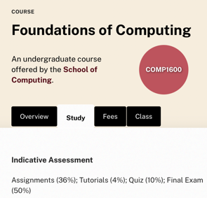
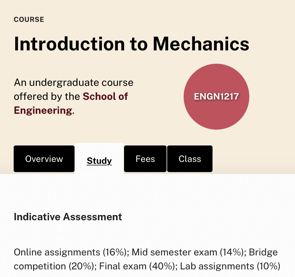

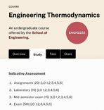
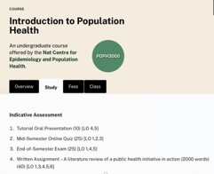

## Effective feedback

Recall an example of  __“good”__  feedback you have experienced as a learner.

__Consider the context, e.g.:__ 

- who 
- what
- when
- where
- how
- why

## Reflection

- By yourself, reflect on your experiences  _giving_  and  _receiving_  learning feedback. _What does effective feedback look like?_
- Individually write down 3 adjectives, _one per sticky note._

_Effective feedback should be…_

## Group discussion

- Share your 3 adjectives with your group and explain why you chose them.
- Discuss everyone's adjectives and create a Group Top 5.

## Principles of effective feedback

## Actionable

- Provides steps the student can take.
- Promotes learner autonomy.
- Is essential for active learning.
- Affects future performance (i.e. is future-focused).

## Constructive

- Focuses on strengths and areas for development.
- Is respectful of the student.
- Is objective and evidence-based.

## Ongoing

- Occurs across the semester.
- Guides students in their progress.
- Supports learning expectations.
- Maintains student engagement.

## Consistent

- Is maintained for all students, teams and the semester.
- Shows clear connection between feedback and marks.
- Is fair and equitable.

## Timely

- Is provided sooner rather than later.
- Respects students’ time and effort.
- Allows students the time to reflect, adjust and improve.

## User Friendly 

- Helps ensure comprehensibility and understandability.
- Ensures that feedback is relevant to learner.
- Enhances the impact of feedback.

## Transparent

- Is open and impartial.
- Demonstrates alignment between learning outcomes, feedback and marks.
- Advises clearly what and how to improve.

## Dialogic

- Provides opportunity to ask questions or clarify.
- Takes the form of a discussion with the student.
- Encourages active engagement with the feedback process.

## Goal Referenced

- Focused on specific goals and tasks.
- Clarifies expected standards or criteria for success.
- Is written with the student in mind.

## Applying the principles

Consider the approach below when providing feedback that promotes the 9 Principles. 
You may also apply facilitation techniques where appropriate.

## Challenges with feedback

"But the tutor told me my project is _great_!"

- Managing time and resources for providing and following up on feedback
- Potential student over-reliance on teacher feedback
- Managing class sizes or marking loads
- Managing student expectations about feedback.
- Effectively tailoring feedback to learner needs
- Potential miscommunication or misunderstanding

What might you do to overcome or address these?

## Takeaways

- Focus on the task, not the learner.
- Remain objective and measure the student’s work against the task objectives, marking criteria and standards.
- Ensure feedback is clear, specific and tailored to the learner.
- Avoid personalisation, e.g. "I …" and "you …" but also personally  _judgemental_  and  _emotive_  words.
- Be careful when discussing marking guidelines, systems, processes or organisation etc.With students. Any student questions or concerns should go to convenors so that messaging is consistent.
- Encourage students to engage with feedback.

# Evaluating feedback

__Individual work__ ​

You will receive a sample assessment with feedback examples from three different markers.

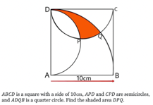
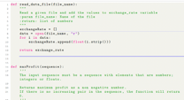
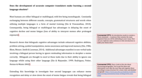

__By yourself, consider:__

- Which marker’s feedback is the most effective?
- What makes it effective?
- What impact would the feedback have on the student?

## Coding examples

## __Group work__ ​

Discuss your thoughts and ideas in your group.

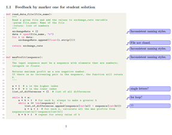
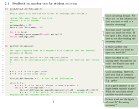
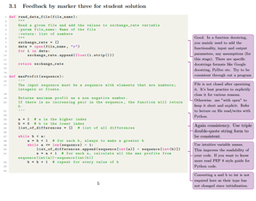

- Which marker’s feedback is the most effective?
- What makes it effective?
- What impact would the feedback have on the student?

## __Group work__ ​

Discuss your thoughts and ideas in your group.

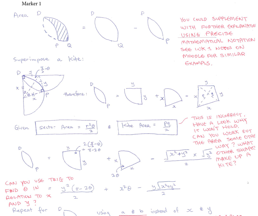
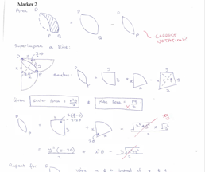
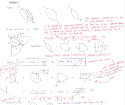

- Which marker’s feedback is the most effective?
- What makes it effective?
- What impact would the feedback have on the student?

## __Group work__ ​

Discuss your thoughts and ideas in your group.

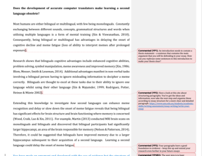
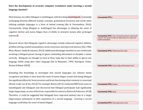
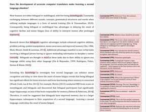

- Which marker’s feedback is the most effective?
- What makes it effective?
- What impact would the feedback have on the student?

## Generative AI & assessments

Generative AI is a quickly and constantly evolving domain. 
Guidance, policies and practices are also changing in response.  
Here are some useful resources that are available now and relevant to your teaching.

- "AI Essentials" resources on the Learning & Teaching blog [https://learningandteaching.anu.edu.au/resource-collection/ai-essentials/](https://learningandteaching.anu.edu.au/resource-collection/ai-essentials/)
- ANU Library AI Guide[https://libguides.anu.edu.au/generative-ai](https://libguides.anu.edu.au/generative-ai)
- Academic Skills: Best practice when using generative AI[https://www.anu.edu.au/students/academic-skills/academic-integrity/best-practice-principles/best-practice-when-using](https://www.anu.edu.au/students/academic-skills/academic-integrity/best-practice-principles/best-practice-when-using)

# Marking criteria

## Marking with rubrics

What do you know about rubrics?
How are rubrics used in your college/team?
How can/should students use rubrics?
How can/should educators use rubrics?

## Rubrics

- Provide clear criteria for both student and marker.
- Allow consistency and clear feedback – where and how students can improve.
- Can be provide various levels of detail.
- Can be used before  __(preparation)__ , during  __(production)__  and after  __(feedback, reflection, review and improvement)__  

## the assessment process

- __Before assessment:__
  - Unpack what is required.
  - Understand expectations and approaches.
  - Focus learning and set goals.
- __During assessment:__
  - Students examine and evaluate own progress.
- __After assessment:__
  - Give feedback against specified criteria.
  - Identify strengths and weaknesses and areas to improve
  - Understand the standards and how grades are allocated

<https://www.uow.edu.au/student/learning-co-op/assessments/rubrics/>

## ANU Grade Standards

| Grade | Letter Grade | Numerical Mark (%) | Standards |
| :-: | :-: | :-: | :-: |
| High Distinction | HD | 80-100 | Work of  __exceptional quality__ , as demonstrated in the attainment of learning outcomes at or above the relevant qualification level |
| Distinction | D | 70-79 | Work of  __superior quality__ , as demonstrated in the attainment of learning outcomes at or above the relevant qualification level |
| Credit | C | 60-69 | Work of  __good quality__ , as demonstrated in the attainment of learning outcomes at or above the relevant qualification level |
| Pass | P | 50-59 | Work of  __satisfactory quality__ , as demonstrated in the attainment of learning outcomes at or above the relevant qualification level |
| Fail | N | 0-49 | Work in which the attainment of learning outcomes at or above the relevant qualification level has not been demonstrated |

[ANU Policy: Student assessment (Coursework)](https://policies.anu.edu.au/ppl/document/ANUP_004603)

## Sample rubrics

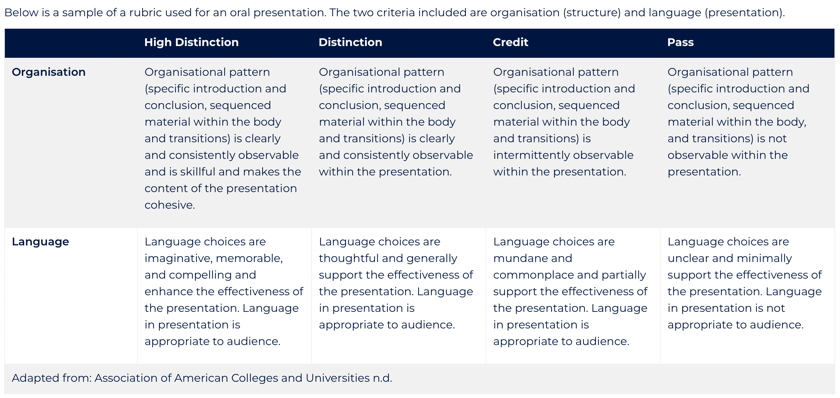
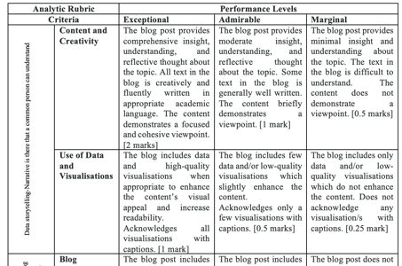
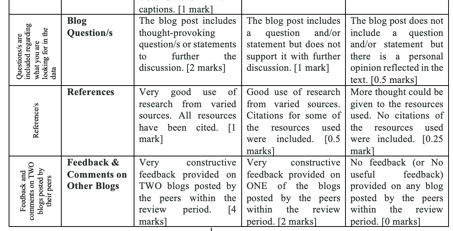

## Takeaways

- Understand (and practise) the tools and approaches for feedback and marking expected in your School or College.
- Where possible, ask for guidance or an opportunity to work or mark as a team.
- Use available rubrics, criteria documents, task descriptions and standards.
- Attend any assessment orientation, benchmarking or moderation meetings organised for the team.
- Set a timer for each stage of the process and stick to it!
- Take regular breaks to avoid fatigue or getting stuck.
- Be selective, deliberate and learning-focused with your feedback.
- Be clear about your feedback _before_ assigning a grade or marks.
