# Feedback and Marking for learning

## Learning outcomes

In this session we will:

- __Identify__ assessments from various courses
- __Identify__ features of effective feedback
- __Evaluate__ different approaches to feedback

## Task: Worries and Questions (5mins)

What worries and questions do you have about feedback and marking?
Use the sticky notes from your table and answer these two questions:

1. What questions do you have about __feedback__?
2. What questions do you have about __marking__?

One question per sticky note! We will hear some together from each table.

# Introduction To Assessment

## Purpose of assessment

__Diagnosing__

- Focus on what is known 
- Beginning of topic/course
- Identifies prior learning

 __Monitoring__ 

- Focus on learning process during a course
- During a topic/course
- Promotes reflection and improvement

 __Evaluating__ 

- Focus on evaluation
- End of topic/course

## Course assessments

What are the assessments in the course(s) you’ll be tutoring in?

- What each assessment involves
- When the assessments are due
- Your role as a tutor

Are these assessments opportunities for feedback? What is the purpose?

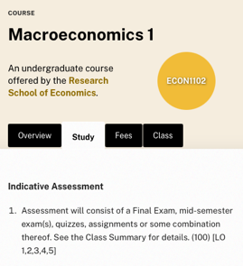{width=20%}
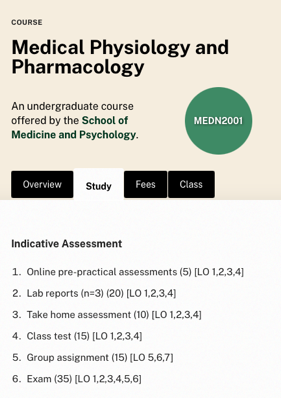{width=20%}
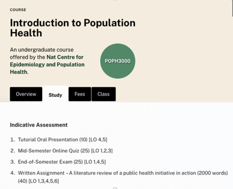{width=20%}
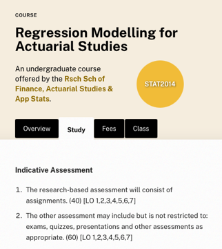{width=20%}

## Effective feedback

Can you think of an example of  __“good”__  feedback you have experienced as a learner?

__Consider the context, e.g.:__ 

- who 
- what
- when
- where
- how
- why

## Task: Effective Feedback (5mins)

- By yourself, reflect on your experiences  _giving_  and  _receiving_  learning feedback. _What does effective feedback look like?_
- Individually write down 3 adjectives, one per sticky note: _Effective feedback should be…_

- Share your 3 adjectives with your group and explain why you chose them.

We will make a big list together on PollEverywhere.

## Principles of effective feedback

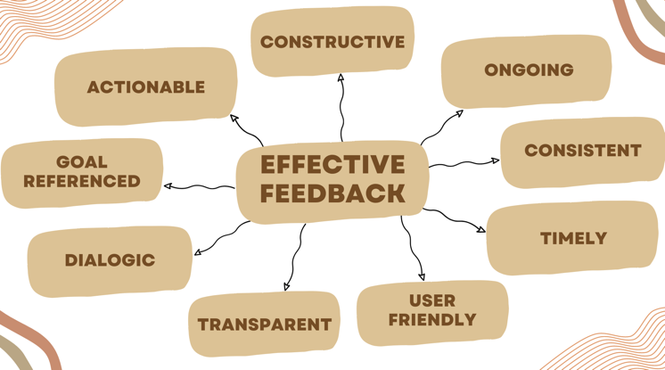{width=75%}

## Actionable

- Provides steps the student can take.
- Promotes learner autonomy.
- Is essential for active learning.
- Affects future performance (i.e. is future-focused).

## Constructive

- Focuses on strengths and areas for development.
- Is respectful of the student.
- Is objective and evidence-based.

## Ongoing

- Occurs across the semester.
- Guides students in their progress.
- Supports learning expectations.
- Maintains student engagement.

## Consistent

- Is maintained for all students, teams and the semester.
- Shows clear connection between feedback and marks.
- Is fair and equitable.

## Timely

- Is provided sooner rather than later.
- Respects students’ time and effort.
- Allows students the time to reflect, adjust and improve.

## User Friendly 

- Helps ensure comprehensibility and understandability.
- Ensures that feedback is relevant to learner.
- Enhances the impact of feedback.

## Transparent

- Is open and impartial.
- Demonstrates alignment between learning outcomes, feedback and marks.
- Advises clearly what and how to improve.

## Dialogic

- Provides opportunity to ask questions or clarify.
- Takes the form of a discussion with the student.
- Encourages active engagement with the feedback process.

## Goal Referenced

- Focused on specific goals and tasks.
- Clarifies expected standards or criteria for success.
- Is written with the student in mind.

## Applying the principles

Consider the approach below when providing feedback that promotes the 9 Principles. 
You may also apply facilitation techniques where appropriate.

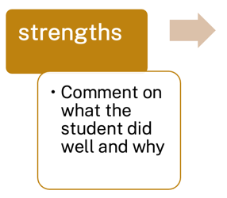{width=25%}
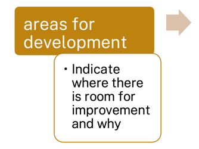{width=25%}
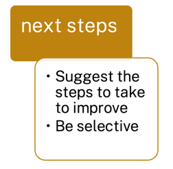{width=25%}

## Challenges with feedback

"But the tutor told me my project is _great_!"

- Managing time and resources for providing and following up on feedback
- Potential student over-reliance on teacher feedback
- Managing class sizes or marking loads
- Managing student expectations about feedback.
- Effectively tailoring feedback to learner needs
- Potential miscommunication or misunderstanding

What might you do to overcome or address these?

## Convenor tips:

Some students will attack feedback and use the content to appeal a grade.

- Know the ANU grading rubric (more later): don't write "excellent work" when it's at the credit level. A credit is "good".
- WRite why the work was at the grade level, and what areas prevent it from being higher.
- If it's a fail, be clear: "This work does not meet our standards... (some parts) show developing understanding (these parts) could be improved".
- Always address the work, not the student.

**Be careful** about providing feedback in person (e.g., in labs) on assessment items outside of written communication. Students can (and do) use casual conversations as a basis for appeal.

## Takeaways

- Focus on the task, not the learner.
- Remain objective and measure the student’s work against the task objectives, marking criteria and standards.
- Ensure feedback is clear, specific and tailored to the learner.
- Avoid personalisation, e.g. "I..." and "you..." but also personally _judgemental_ and _emotive_ words.
- **Be careful** when discussing marking guidelines, systems, processes or organisation with students. Any student questions or concerns should go to convenors so that messaging is consistent.
- Encourage students to engage with feedback.

# Evaluating Feedback

## Task: Evaluating Code Feedback (10mins)

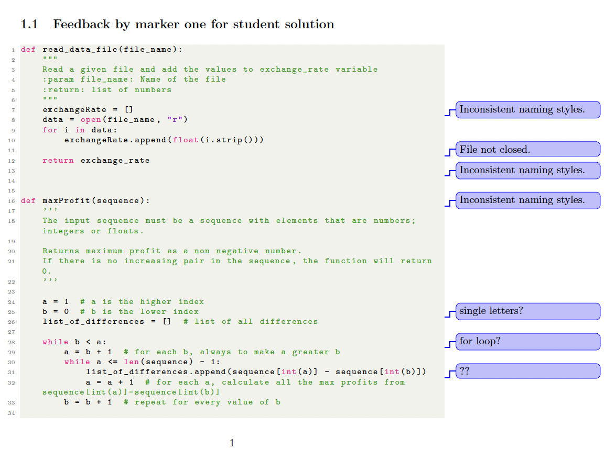{width=32%}
{width=32%}
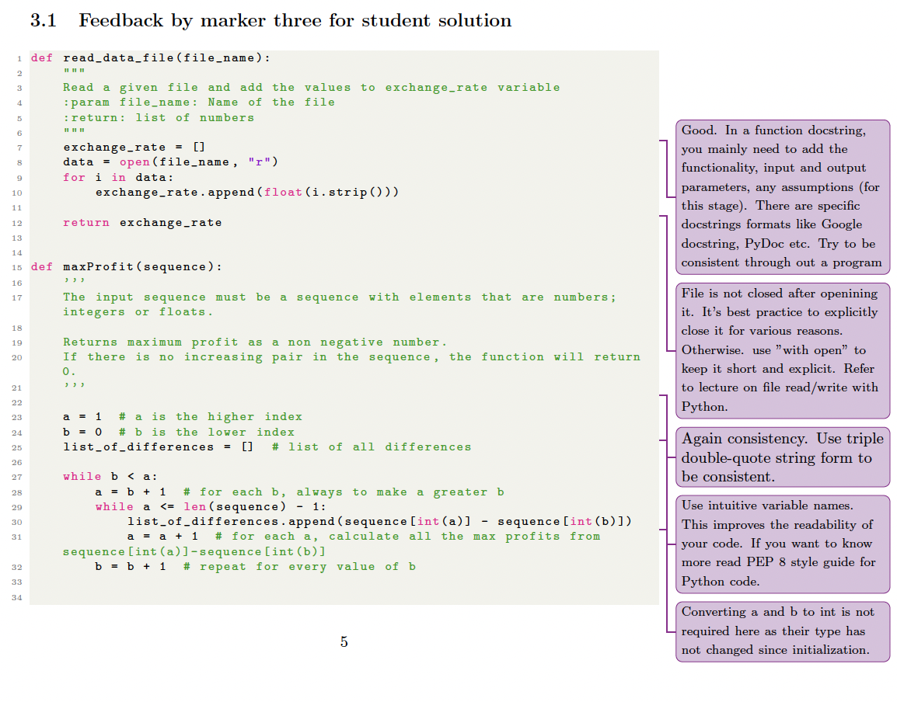{width=32%}

- Which marker’s feedback is the most effective?
- What makes it effective?
- What impact would the feedback have on the student?

## Task: Evaluating Essay Feedback (10mins)

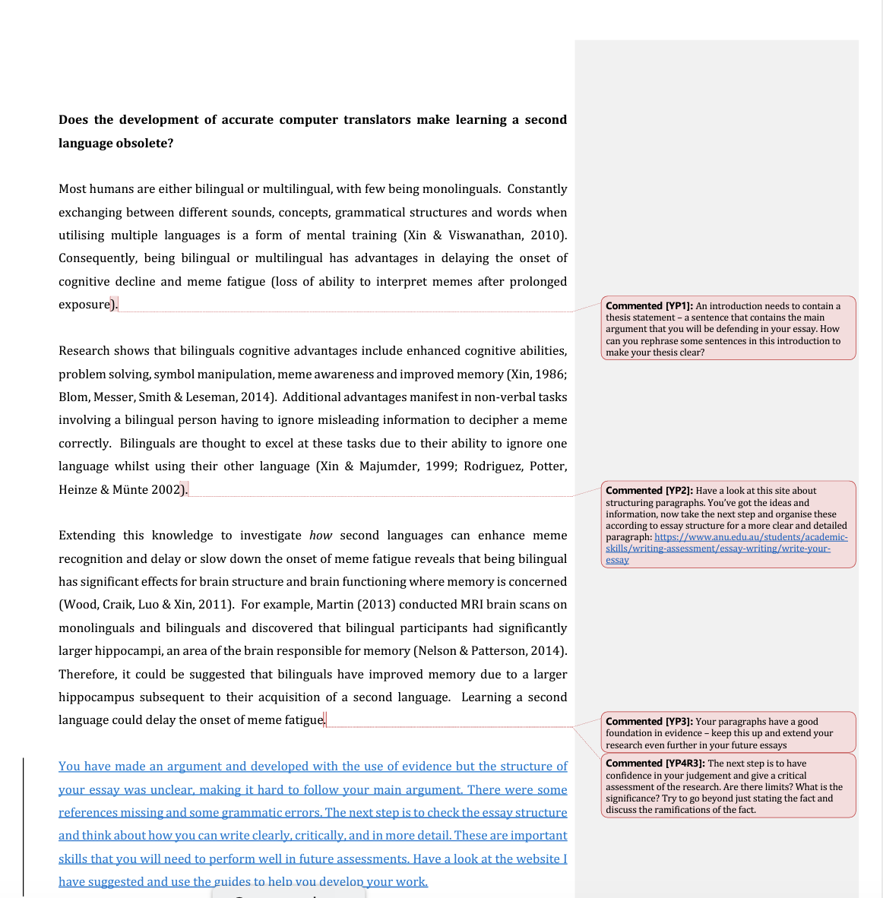{width=32%}
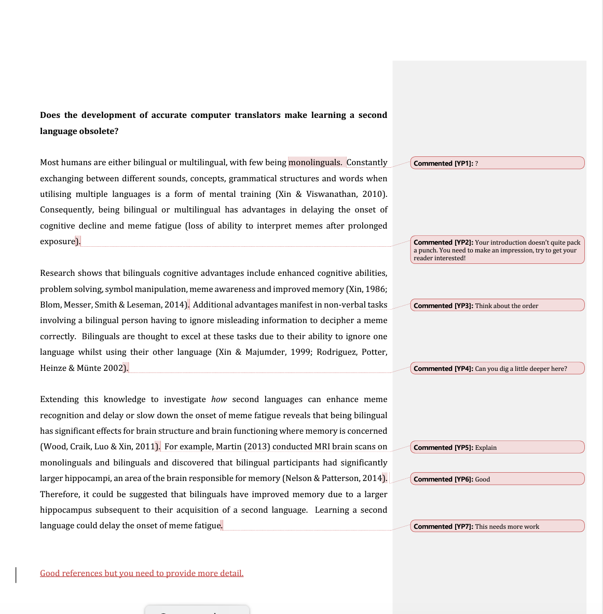{width=32%}
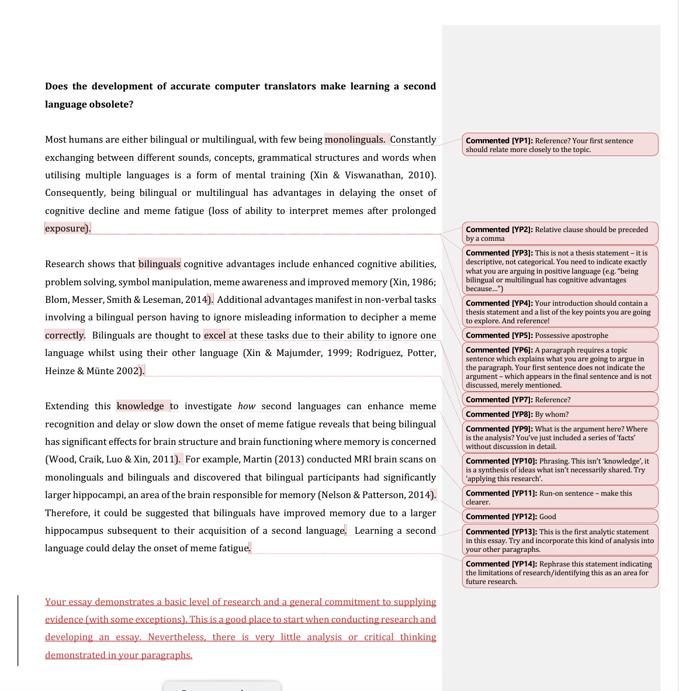{width=32%}

- Which marker’s feedback is the most effective?
- What makes it effective?
- What impact would the feedback have on the student?

## Task: Evaluating Maths Feedback (10mins)

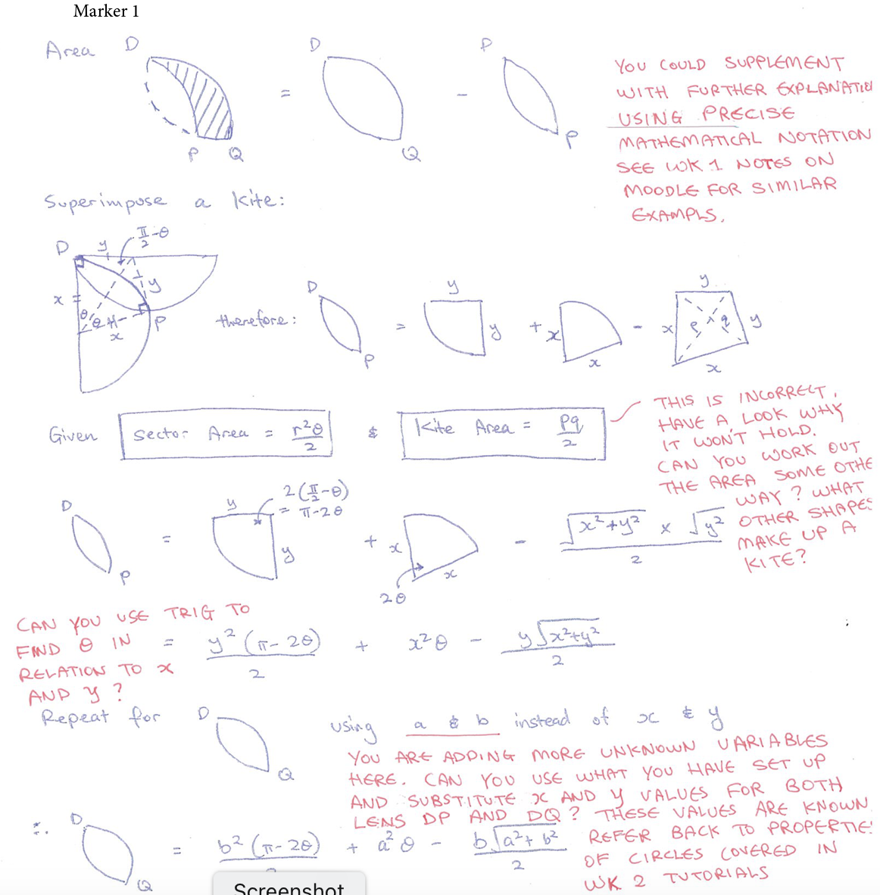{width=32%}
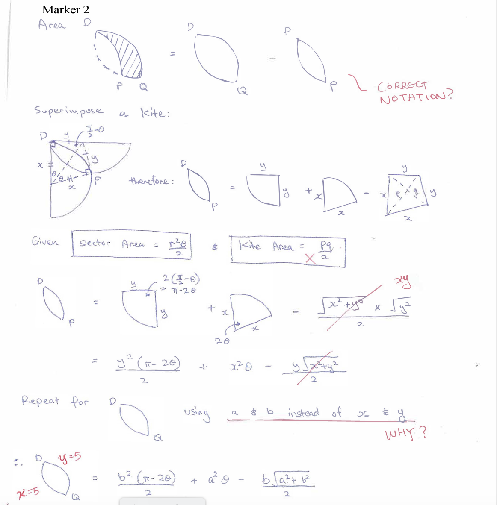{width=32%}
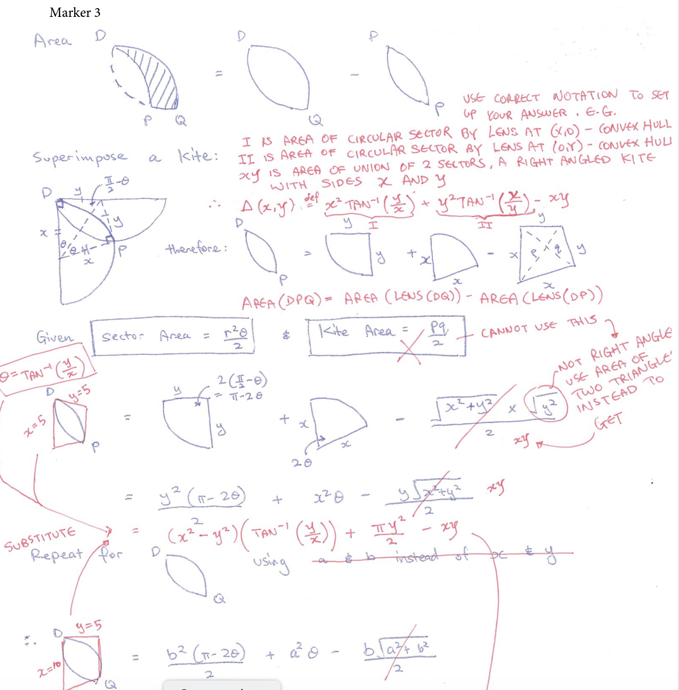{width=32%}

- Which marker’s feedback is the most effective?
- What makes it effective?
- What impact would the feedback have on the student?

<!-- 
## Generative AI

Generative AI is a quickly and constantly evolving domain. 
Guidance, policies and practices are also changing in response.  
Here are some useful resources that are available now and relevant to your teaching.

- "AI Essentials" resources on the Learning & Teaching blog [https://learningandteaching.anu.edu.au/resource-collection/ai-essentials/](https://learningandteaching.anu.edu.au/resource-collection/ai-essentials/)
- ANU Library AI Guide[https://libguides.anu.edu.au/generative-ai](https://libguides.anu.edu.au/generative-ai)
- Academic Skills: Best practice when using generative AI[https://www.anu.edu.au/students/academic-skills/academic-integrity/best-practice-principles/best-practice-when-using](https://www.anu.edu.au/students/academic-skills/academic-integrity/best-practice-principles/best-practice-when-using) -->

# Rubrics and Marking Criteria

<!-- ## Task: Talking about Rubrics (5mins)

Let's have a bit of a discussion:

- What do you know about rubrics or marking criteria?
- How would you find out the marking rubric for a task?
- How can/should students use rubrics?
- How can/should educators use rubrics? -->

## Rubrics

**Question:** Do you look at rubrics or marking criteria as a student? Do you know how to find them?

- Provide clear criteria for both student and marker.
- Allow consistency and clear feedback – where and how students can improve.
- Can be provide various levels of detail.
- Can be used before  __(preparation)__ , during  __(production)__  and after  __(feedback, reflection, review and improvement)__

## Rubrics in the assessment process

- __Before assessment:__
  - Unpack what is required.
  - Understand expectations and approaches.
  - Focus learning and set goals.
- __During assessment:__
  - Students examine and evaluate own progress.
- __After assessment:__
  - Give feedback against specified criteria.
  - Identify strengths and weaknesses and areas to improve
  - Understand the standards and how grades are allocated

<https://www.uow.edu.au/student/learning-co-op/assessments/rubrics/>

## ANU Grade Standards

| Grade | Letter Grade | Mark (%) | Standards |
| :-: | :-: | :-: | :-: |
| High Distinction | HD | 80-100 | __exceptional quality__... |
| Distinction | D | 70-79 | __superior quality__... |
| Credit | C | 60-69 | __good quality__...|
| Pass | P | 50-59 | __satisfactory quality__... |
| Fail | N | 0-49 | Attainment of learning outcomes has **not been demonstrated** |

[ANU Policy: Student assessment (Coursework)](https://policies.anu.edu.au/ppl/document/ANUP_004603)

## Rubric: Blog

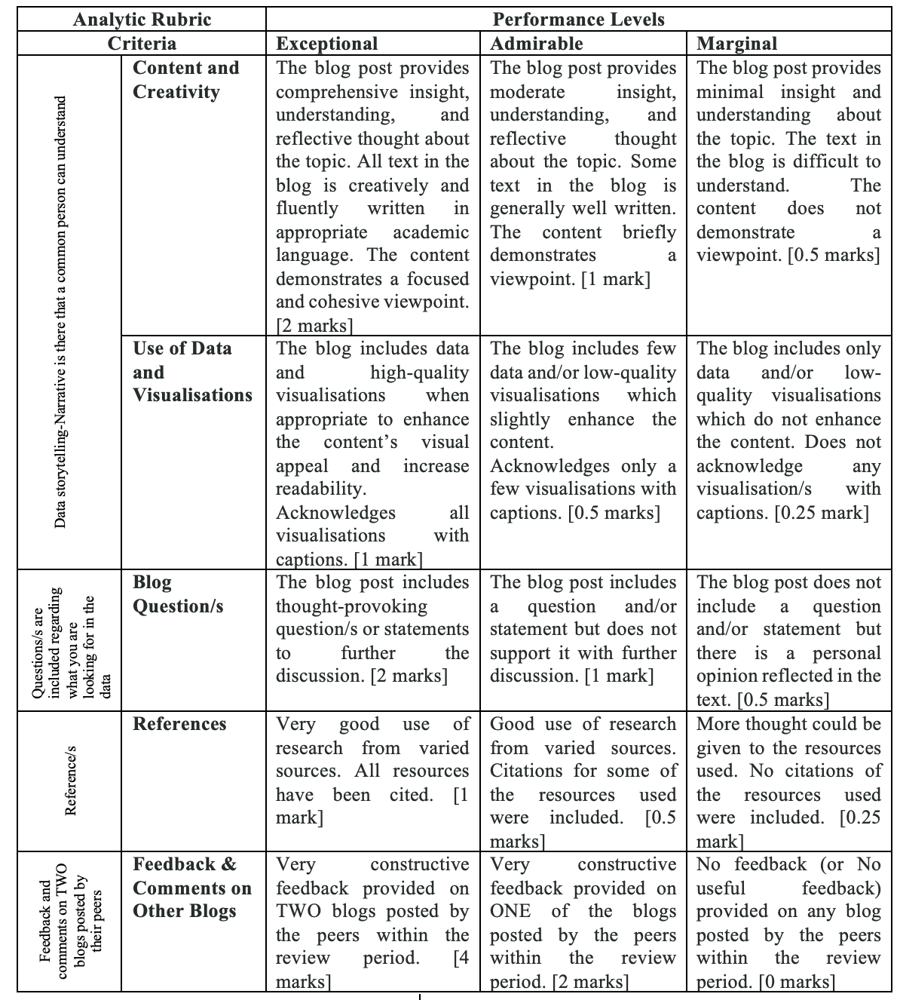{width=50%}

## Rubric: Essay

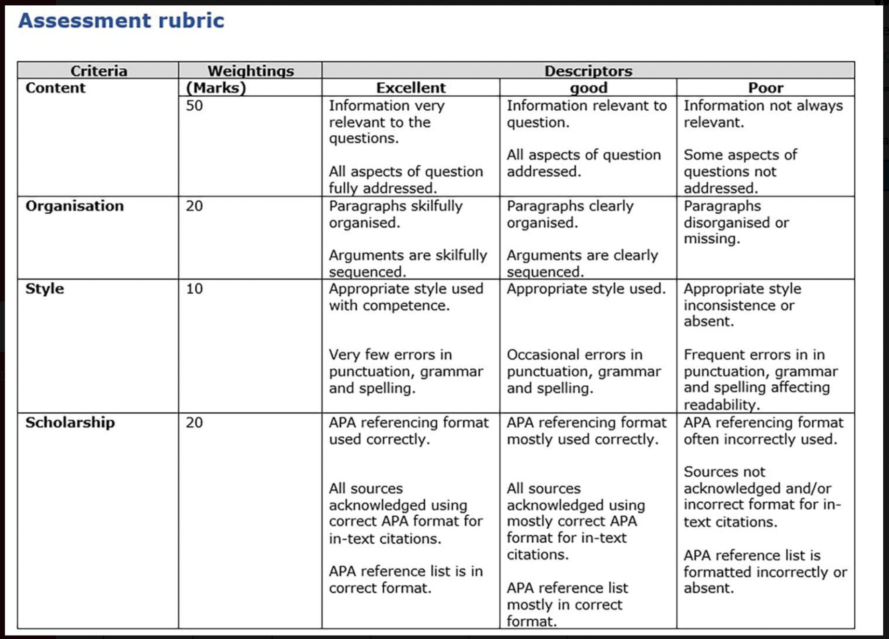{width=60%}

## Rubric: Presentation

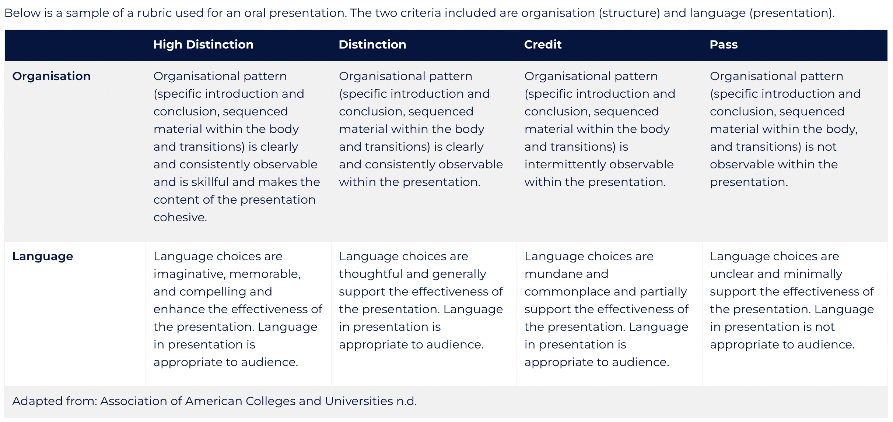{width=75%}

## Rubric: Sonic Artwork (COMP1720)

::: {.small-table}

| CRITERIA | HD | D | CR | P | N |
|---|---|---|---|---|---|
| Sophistication of articulation and application of concepts of computer-based art. (50%) | The artwork applies highly sophisticated concepts. The statement describes and critically engages in these qualities to an excellent or outstanding degree. | The artwork that applies sophisticated concepts. The statement that describes and discusses these qualities. | Some concepts have been applied but there may be gaps in sophistication. The statement describes these qualities. | The artwork that may only apply some concepts or apply them in a simplistic way. The statement describes these qualities. | The artwork does not sufficiently apply these concepts and the statement may not describe them sufficiently. |
| Sophistication of application of visual and physical interaction concepts that reflects on recent developments. (25%) | Excellent to outstanding interactions that are expressive, sophisticated, and enhance the viewer’s experience. | Very good application interactions that are expressive and enhance the viewer’s experience. | Interactions that are expressive but may not enhance the viewer’s experience. | Interactions that may be simplistic rather than expressive and do not enhance the viewer’s experience. | The work may not feature significant interactive features or features that do not engage the viewer or enhance their experience. |
| Sophistication of design and construction of a p5.js program that is appropriate for the task. (25%) | Excellent to outstanding program design that is appropriate for the task and supports a highly engaging experience for the viewer. | Very good program design that is appropriate for the task and supports an engaging experience for the viewer. | Good design and construction. The program is functional and sufficiently sophisticated to support the task. | The program is functional and supports the task, but may not be entirely appropriate or sufficiently sophisticated. | The program does not adequately support the task, is not appropriate, or is not sufficiently sophisticated. |{font-size: 12px;}

:::

## Rubric: Solo Computer Music Work (COMP4350)

::: {.small-table}

| CRITERIA | HD | D | CR | P | N |
|---|---|---|---|---|---|
| Sophistication of application of fundamental concepts in sound and music computing. (50%) | Excellent to outstanding SMC implementations going beyond learning materials. | Very good application of SMC concepts, but not beyond learning materials. | Application of SMC at level of learning materials. May have gaps in some areas. | Some effort to replicate SMC learning materials resulting in functional SMC software. May have only applied some SMC concepts covered. | Very little SMC software or software that is below the level of learning materials. |
| Sophistication as a solo performance with a computer music instrument, of a computer music composition or as an interactive media work. (50%) | Excellent to outstanding performance. Sophisticated interaction and presentation demonstrating in-depth exploration of SMC software. Excellent adherence to the submission format. | Very good as a computer music performance with detailed interaction and presentation that demonstrates the SMC software. Excellent adherence to the submission format. | A good computer music performance that may not show sophisticated interaction and presentation of the SMC software. Good adherence to the submission format. | A satisfactory performance that may have limited interaction and weak presentation of the SMC software. The adherence to the submission format may be poor. | Below acceptable standards as a performance. May have very poor adherence to submission format. |

:::

<!-- ## Grade Level to Marks

Tip for marking from a rubric: Work out consistent marks for each grade level, e.g., for a criterion out of 10:

| Total | HD   | D   | CR | P   | N   |
|-------|------|-----|----|-----|-----|
| 10    | 8-10 | 7   | 6  | 5   | 0-4 |
| 5     | 4-5  | 3-4 | 3  | 2-3 | 0-2 |
| 4     | 4    | 3   | 2  | 2   | 0-1 |
| 2     | 2    | 2   | 1  | 1   | 0   | -->

## Takeaways

- Understand (and practise) the tools and approaches for feedback and marking expected in your School or College.
- Where possible, ask for guidance or an opportunity to work or mark as a team.
- Use available rubrics, criteria documents, task descriptions and standards.
- Attend any assessment orientation, benchmarking or moderation meetings organised for the team.
- Set a timer for each stage of the process and stick to it!
- Take regular breaks to avoid fatigue or getting stuck.
- Be selective, deliberate and learning-focused with your feedback.
- Be clear about your feedback _before_ assigning a grade or marks.

## More Resources

- [High Impact Teaching Strategies](https://www.education.vic.gov.au/Documents/school/teachers/support/high-impact-teaching-strategies.pdf) (Victoria State Government)