## Plan for this session

In this session we will:

1. Understand a bit about the goals and design of assessments
2. Look at the features of effective feedback
3. Evaluate some different approaches to feedback
4. Look at how rubrics can support assessment

## Task: Worries and Questions (5mins)

:::::::::::::: {.columns}
::: {.column width="60%"}
> What worries and questions do you have about feedback and marking?

Use the sticky notes from your table and answer these two questions:

1. What questions do you have about **feedback**?
2. What questions do you have about **marking**?

One question per sticky note! We will hear some together from each table.
:::
::: {.column width="40%"}

:::
::::::::::::::

# Assessment and Feedback

## Purpose of assessment

:::::::::::::: {.columns}
::: {.column width="50%"}
**Diagnosing**

- Focus on what is known 
- Beginning of topic/course
- Identifies prior learning

**Monitoring**

- Focus on learning process during a course
- During a topic/course
- Promotes reflection and improvement
:::
::: {.column width="50%"}
**Evaluating**

- Focus on evaluation
- End of topic/course
:::
::::::::::::::

## Discussion: What are your course's assessments? (5mins)

:::::::::::::: {.columns}
::: {.column width="60%"}
> What are the assessments in the course(s) you'll be tutoring in?

With others tutoring the same course, list them and note:

- What each assessment involves
- When the assessments are due
- Your role as a tutor

Then discuss: **are these assessments opportunities for feedback? What is their purpose?**
:::
::: {.column width="40%"}
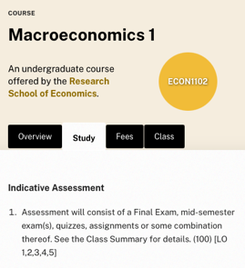{width=40%}
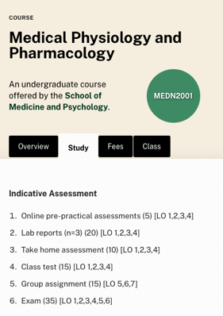{width=40%}
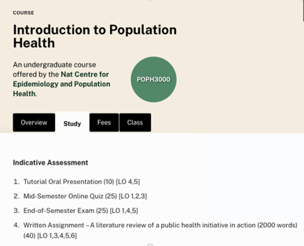{width=40%}
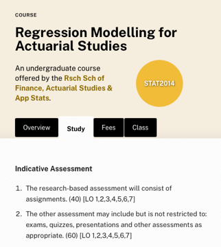{width=40%}
:::
::::::::::::::

<!-- ## Effective feedback

Can you think of an example of  **“good”**  feedback you have experienced as a learner?

**Consider the context, e.g.:**

- who
- what
- when
- where
- how
- why -->

## Task: Effective Feedback (5mins)

:::::::::::::: {.columns}
::: {.column width="60%"}
By yourself, reflect on your experiences  _giving_  and  _receiving_ learning feedback. _What does effective feedback look like?_

Individually write down 3 adjectives, one per sticky note: _Effective feedback should be…_

Share your 3 adjectives with your group and explain why you chose them.

We will make a big list together on PollEverywhere.
:::
::: {.column width="40%"}

:::
::::::::::::::

## Principles of effective feedback

:::::::::::::: {.columns}
::: {.column width="50%"}
Feedback is _not_ just a judgement, nor a list of everything that went wrong. It is **information that helps a learner improve**.

Effective feedback tends to share nine qualities — grouped here by _what it does_, _how it's delivered_, and _how it builds over time_.
:::
::: {.column width="50%"}
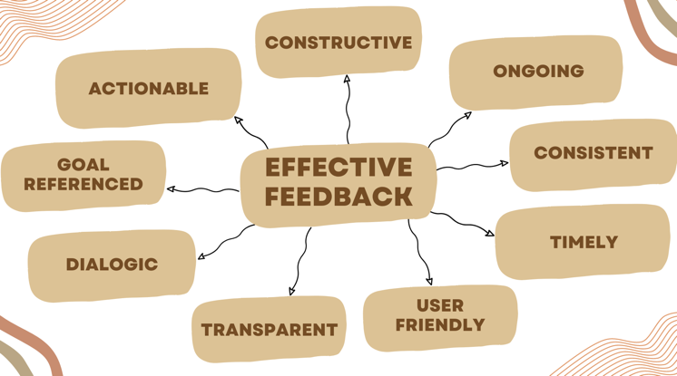
:::
::::::::::::::

## What effective feedback *does*

- **Actionable:** gives the student concrete steps to take next; it is future-focused, not just a verdict on the past.
- **Goal referenced:** measured against the task's stated goals, criteria and standards.
- **Constructive:** names strengths *and* areas to develop; objective, evidence-based, and respectful of the student.

## How effective feedback is *delivered*

- **Timely:** arrives soon enough that the student can still act on it, and respects their time and effort.
- **User friendly:** clear, understandable and relevant to the learner; avoids jargon and marker shorthand.
- **Transparent:** shows how the mark follows from the criteria, and says clearly what to improve and how.

## How effective feedback *builds over time*

- **Ongoing:** happens across the semester to guide progress, not just once at the end.
- **Consistent:** fair and equitable across all students; comments and marks line up with each other.
- **Dialogic:** a two-way conversation where students can ask questions, clarify, and engage.

## Applying the principles

Consider this approach below when providing feedback:

1. **Strengths:** Comment on what the student did well and why.
2. **Areas for development:** Indicate where there is room for improvement and why.
3. **Next steps:** Suggest steps to improve, but be selective.

You may also apply facilitation techniques where appropriate.

## Discussion: Challenges with feedback (5mins)

"But the tutor told me my project is _great_!"

- Managing time and resources for providing and following up on feedback
- Potential student over-reliance on teacher feedback
- Managing class sizes or marking loads
- Managing student expectations about feedback.
- Effectively tailoring feedback to learner needs
- Potential miscommunication or misunderstanding

What might you do to overcome or address these?

## Tips from a Convenor

Some students will attack feedback and use the content to appeal a grade.

- Know the ANU grading rubric (more later): don't write "excellent work" when it's at the credit level. A credit is "good".
- Write why the work was at the grade level, and what areas prevent it from being higher.
- If it's a fail, be clear: "This work does not meet our standards... (some parts) show developing understanding (these parts) could be improved".
- Always address the work, not the student.

**Be careful** about providing feedback in person (e.g., in labs) on assessment items outside of written communication. Students can (and do) use casual conversations as a basis for appeal.

## Takeaways

- Focus on the task, not the learner.
- Remain objective and measure the student’s work against the task objectives, marking criteria and standards.
- Ensure feedback is clear, specific and tailored to the learner.
- Avoid personalisation, e.g. "I..." and "you..." but also personally _judgemental_ and _emotive_ words.
- **Be careful** when discussing marking guidelines, systems, processes or organisation with students. Any student questions or concerns should go to convenors so that messaging is consistent.
- Encourage students to engage with feedback.

# Evaluating Feedback

## Task: Evaluating Code Feedback (10mins)

(zoom in on each example...)

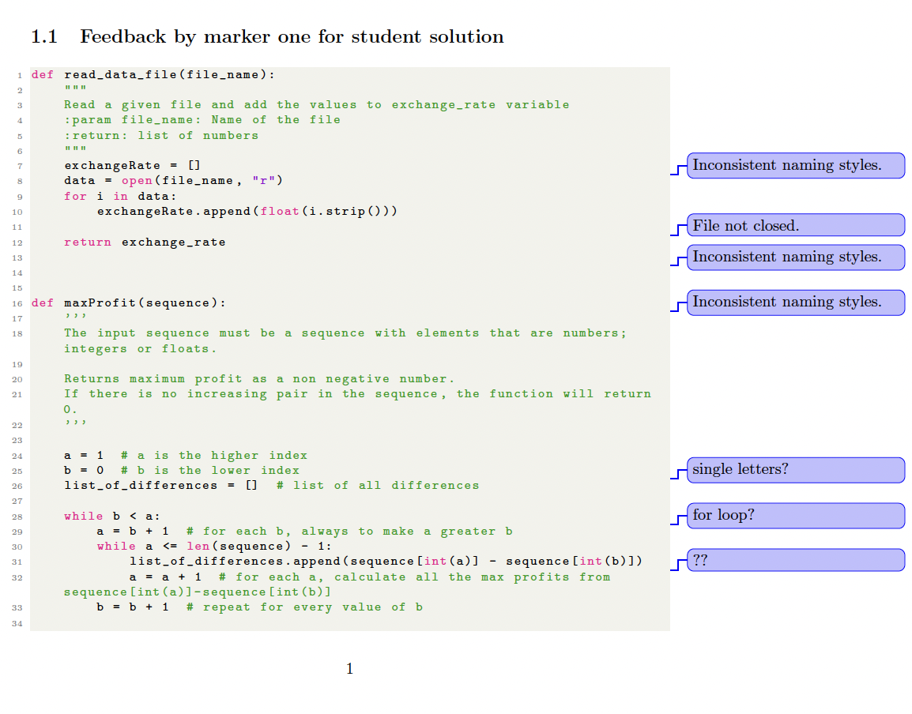{width=32%}
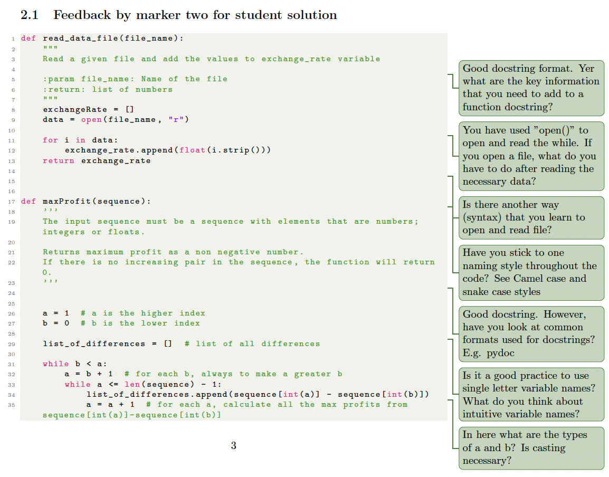{width=32%}
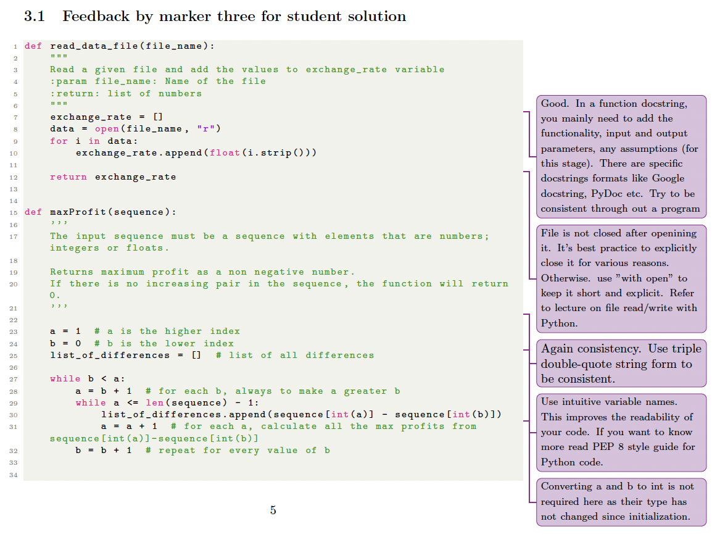{width=32%}

- Which marker’s feedback is the most effective?
- What makes it effective?
- What impact would the feedback have on the student?

## Task: Evaluating Essay Feedback (10mins)

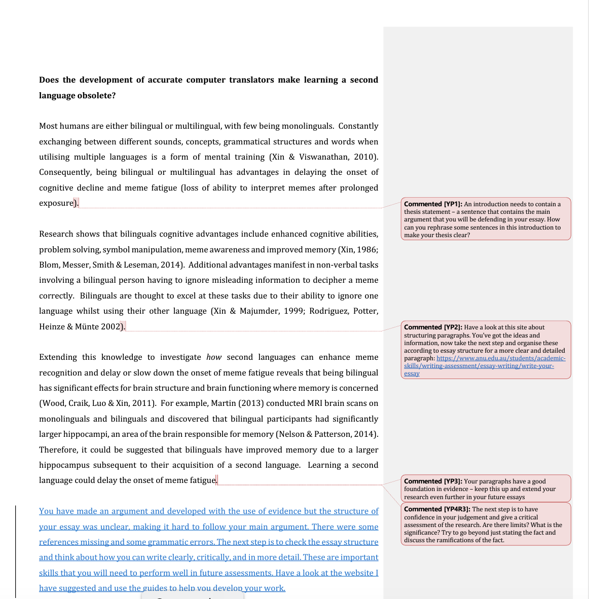{width=32%}
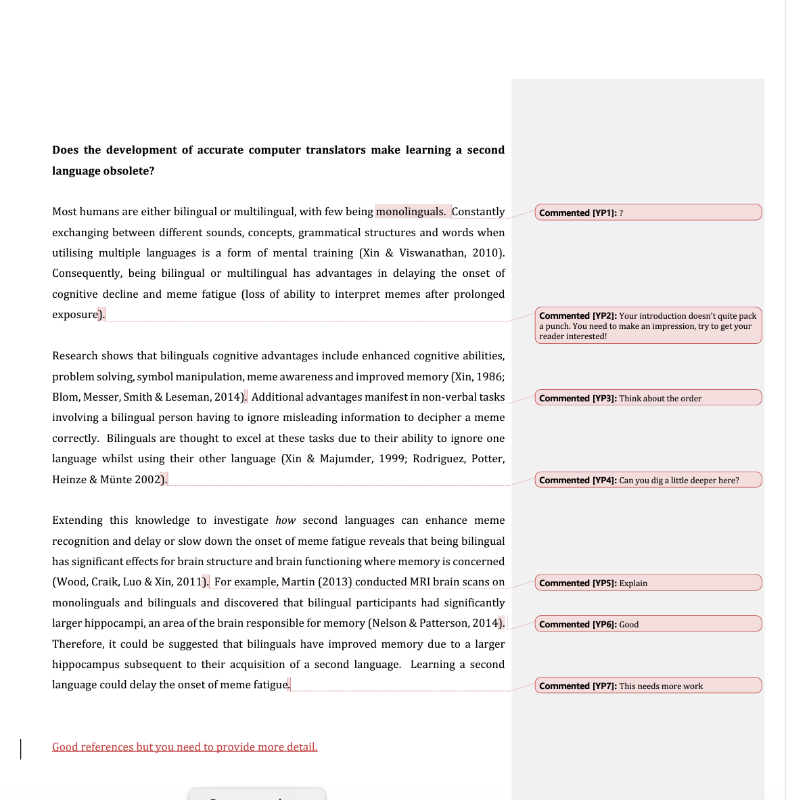{width=32%}
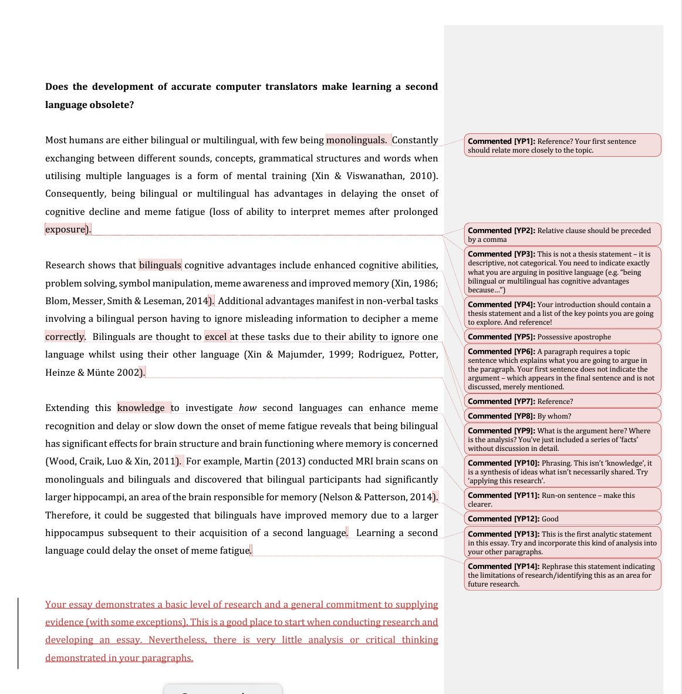{width=32%}

- Which marker’s feedback is the most effective?
- What makes it effective?
- What impact would the feedback have on the student?

## Task: Evaluating Maths Feedback (10mins)

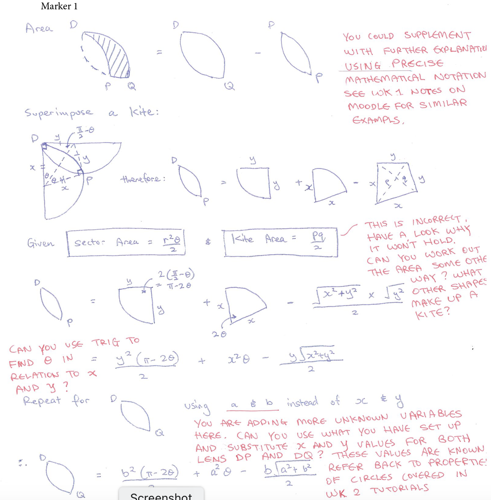{width=32%}
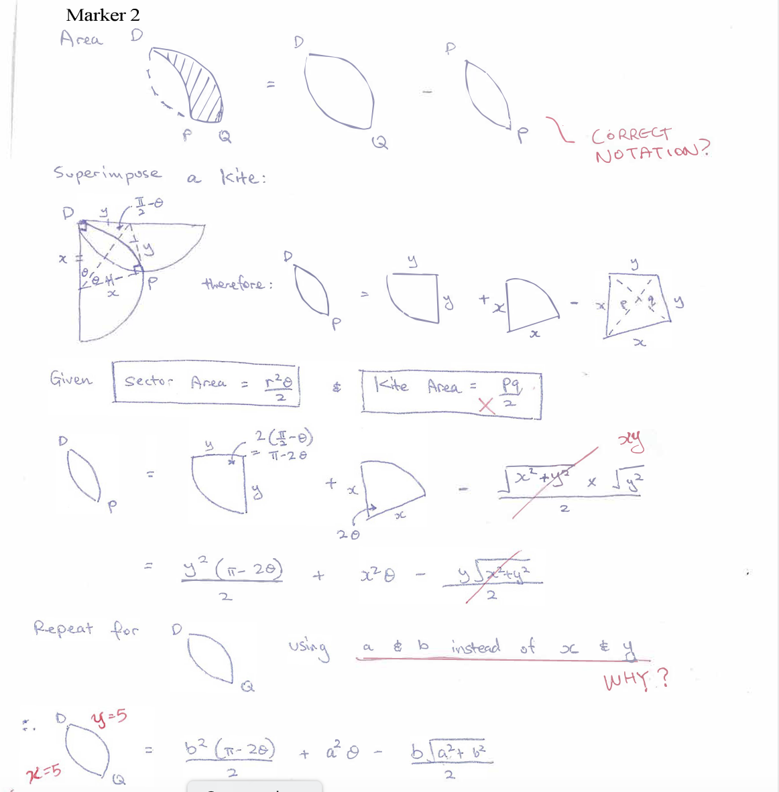{width=32%}
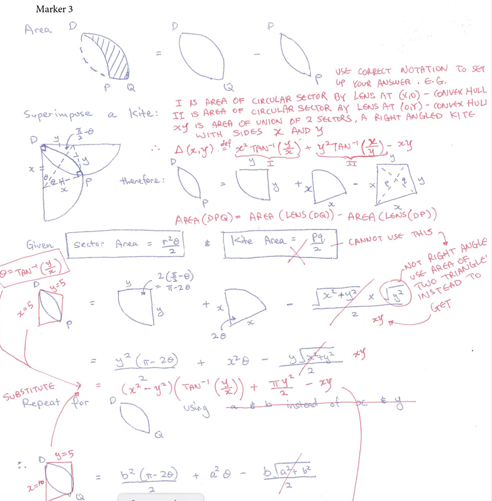{width=32%}

- Which marker’s feedback is the most effective?
- What makes it effective?
- What impact would the feedback have on the student?

<!-- 
## Generative AI

Generative AI is a quickly and constantly evolving domain. 
Guidance, policies and practices are also changing in response.  
Here are some useful resources that are available now and relevant to your teaching.

- "AI Essentials" resources on the Learning & Teaching blog [https://learningandteaching.anu.edu.au/resource-collection/ai-essentials/](https://learningandteaching.anu.edu.au/resource-collection/ai-essentials/)
- ANU Library AI Guide[https://libguides.anu.edu.au/generative-ai](https://libguides.anu.edu.au/generative-ai)
- Academic Skills: Best practice when using generative AI[https://www.anu.edu.au/students/academic-skills/academic-integrity/best-practice-principles/best-practice-when-using](https://www.anu.edu.au/students/academic-skills/academic-integrity/best-practice-principles/best-practice-when-using) -->

# Rubrics and Marking Criteria

<!-- ## Task: Talking about Rubrics (5mins)

Let's have a bit of a discussion:

- What do you know about rubrics or marking criteria?
- How would you find out the marking rubric for a task?
- How can/should students use rubrics?
- How can/should educators use rubrics? -->

## What is a rubric?

The word "rubric" is used loosely: it can mean anything from a _secret scoring sheet_ held only by the marker, to a shared, student-co-created _articulation of quality_ [@dawson_assessment_rubrics].

Most rubrics share **three essential features**:

- **Evaluative criteria** – the qualities the work is judged on.
- **Quality definitions** – what each criterion looks like at each level.
- **A scoring strategy** – how those judgements become marks or a grade.

Clarity about what a task's rubric actually provides helps you mark consistently.

_Do you look at rubrics or marking criteria as a student? Do you know how to find them for the course you'll tutor?_

## How rubrics differ

@dawson_assessment_rubrics identifies **14 design elements** that make one rubric different from another. Here's a few highlights:

- **Specificity** – _generic_ (reusable across tasks) vs _task-specific_.
- **Secrecy** – _shared_ with students up front vs a private marking sheet.
- **Scoring strategy** – _analytic_ (score each criterion, then combine) vs _holistic_ (one overall judgement).
- **Quality levels** – how many levels, and how they map to grades.
- **Users and uses** – planning, self/peer assessment, feedback, summative grading.

Naming these choices helps a marking team reach a **shared understanding** of the same rubric.

## Rubrics in the assessment process

- **Before assessment:**
  - Unpack what is required.
  - Understand expectations and approaches.
  - Focus learning and set goals.
- **During assessment:**
  - Students examine and evaluate own progress.
  - Teachers use rubrics as focal point for moderation (e.g., in a larger cohort)
- **After assessment:**
  - Give feedback against specified criteria.
  - Identify strengths and weaknesses and areas to improve
  - Understand the standards and how grades are allocated

<https://www.uow.edu.au/student/learning-co-op/assessments/rubrics/>

## ANU Grade Standards

| Grade | Letter Grade | Mark (%) | Standards |
| :-: | :-: | :-: | :-: |
| High Distinction | HD | 80-100 | **exceptional quality**... |
| Distinction | D | 70-79 | **superior quality**... |
| Credit | C | 60-69 | **good quality**...|
| Pass | P | 50-59 | **satisfactory quality**... |
| Fail | N | 0-49 | Attainment of learning outcomes has **not been demonstrated** |

[ANU Policy: Student assessment (Coursework)](https://policies.anu.edu.au/ppl/document/ANUP_004603)

## Task: Reading a Rubric (10mins)

The next slides show **example rubrics** — the first four are generic samples (including a generic programming rubric), and the last two are from real ANU computing courses (COMP1720 and COMP4350) — note both assess _creative, music-themed_ work rather than conventional code. In pairs, pick **one** — ideally the closest to a task you'll mark — and work out:

1. **The three essential features** – where are the _evaluative criteria_, the _quality definitions_, and the _scoring strategy_? Is any missing or unclear?
2. **Two design choices** – is it _generic_ or _task-specific_? _Analytic_ or _holistic_? How many _quality levels_?
3. **As a marker** – what would be easy, and what would be hard to judge consistently?

We'll hear from a couple of pairs.

## Rubric: Programming Assignment

::: {.small-table}

| CRITERIA | Exceptional | Acceptable | Amateur | Unsatisfactory |
|---|---|---|---|---|
| **Specifications** | Works and meets all specifications. | Works and produces correct results; meets most other specs. | Produces correct results but displays them incorrectly. | Produces incorrect results. |
| **Readability** | Exceptionally organised and very easy to follow. | Fairly easy to read. | Readable only by someone who knows what it should do. | Poorly organised and very difficult to read. |
| **Reusability** | Whole program or each routine could be reused. | Most of the code could be reused. | Some parts could be reused. | Not organised for reuse. |
| **Documentation** | Well written; clearly explains what the code does and how. | Embedded comments plus useful header documentation. | Comments and simple headers separating routines. | Comments that don't help the reader understand the code. |
| **Delivery** | On time. | Within a week of the due date. | Within two weeks of the due date. | More than two weeks overdue. |
| **Efficiency** | Very efficient without sacrificing readability. | Fairly efficient without sacrificing readability. | Brute force and unnecessarily long. | Huge and appears patched together. |{font-size: 12px;}

:::

Adapted from a generic programming rubric, [CSU Long Beach](https://provost.fiu.edu/apa/assessment/resources/rubrics-and-curriculum-maps/_assets/rubrics/Computer%20Programming%20Grading%20Rubric%20-%20California%20State%20University%20Long%20Beach.pdf).

## Rubric: Blog

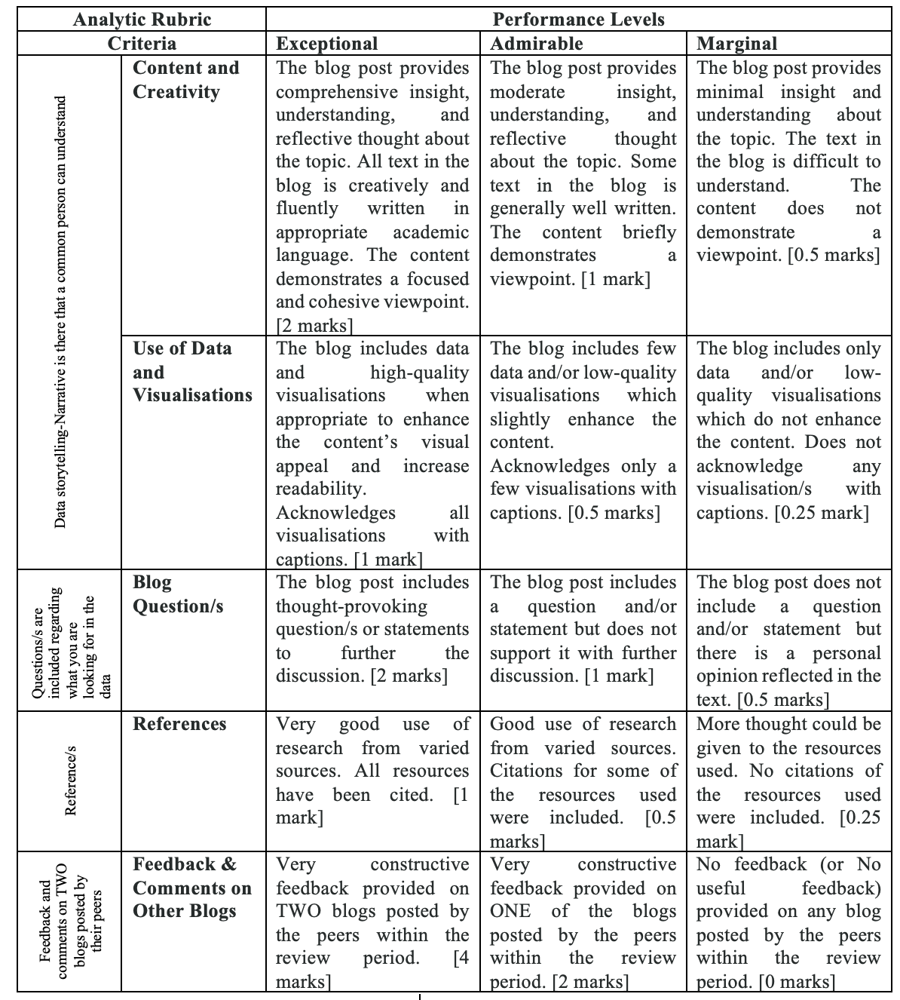{width=45%}

## Rubric: Essay

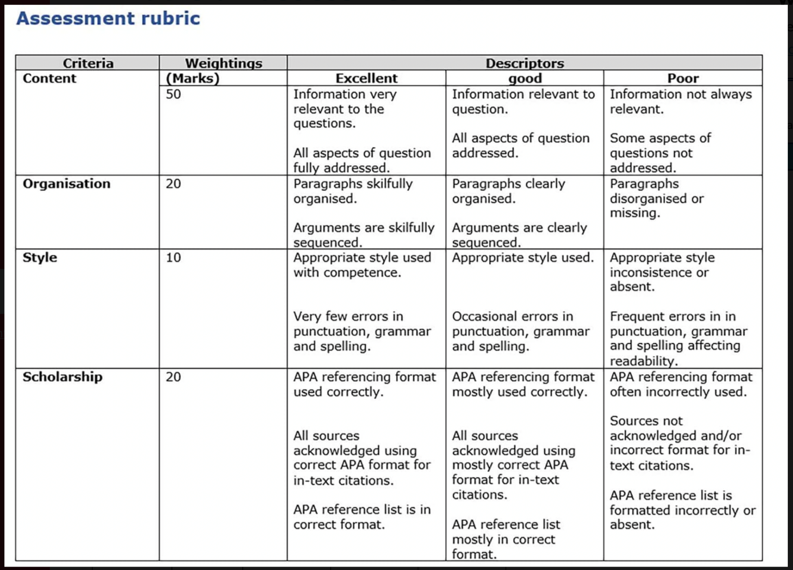{width=60%}

## Rubric: Presentation

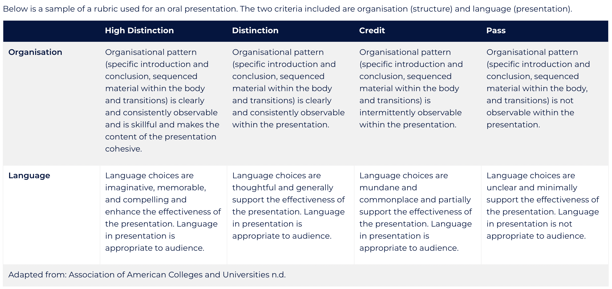{width=75%}

## Rubric: Sonic Artwork (COMP1720)

::: {.small-table}

| CRITERIA | HD | D | CR | P | N |
|---|---|---|---|---|---|
| Sophistication of articulation and application of concepts of computer-based art. (50%) | The artwork applies highly sophisticated concepts. The statement describes and critically engages in these qualities to an excellent or outstanding degree. | The artwork that applies sophisticated concepts. The statement that describes and discusses these qualities. | Some concepts have been applied but there may be gaps in sophistication. The statement describes these qualities. | The artwork that may only apply some concepts or apply them in a simplistic way. The statement describes these qualities. | The artwork does not sufficiently apply these concepts and the statement may not describe them sufficiently. |
| Sophistication of application of visual and physical interaction concepts that reflects on recent developments. (25%) | Excellent to outstanding interactions that are expressive, sophisticated, and enhance the viewer’s experience. | Very good application interactions that are expressive and enhance the viewer’s experience. | Interactions that are expressive but may not enhance the viewer’s experience. | Interactions that may be simplistic rather than expressive and do not enhance the viewer’s experience. | The work may not feature significant interactive features or features that do not engage the viewer or enhance their experience. |
| Sophistication of design and construction of a p5.js program that is appropriate for the task. (25%) | Excellent to outstanding program design that is appropriate for the task and supports a highly engaging experience for the viewer. | Very good program design that is appropriate for the task and supports an engaging experience for the viewer. | Good design and construction. The program is functional and sufficiently sophisticated to support the task. | The program is functional and supports the task, but may not be entirely appropriate or sufficiently sophisticated. | The program does not adequately support the task, is not appropriate, or is not sufficiently sophisticated. |{font-size: 12px;}

:::

## Rubric: Solo Computer Music Work (COMP4350)

::: {.small-table}

| CRITERIA | HD | D | CR | P | N |
|---|---|---|---|---|---|
| Sophistication of application of fundamental concepts in sound and music computing. (50%) | Excellent to outstanding SMC implementations going beyond learning materials. | Very good application of SMC concepts, but not beyond learning materials. | Application of SMC at level of learning materials. May have gaps in some areas. | Some effort to replicate SMC learning materials resulting in functional SMC software. May have only applied some SMC concepts covered. | Very little SMC software or software that is below the level of learning materials. |
| Sophistication as a solo performance with a computer music instrument, of a computer music composition or as an interactive media work. (50%) | Excellent to outstanding performance. Sophisticated interaction and presentation demonstrating in-depth exploration of SMC software. Excellent adherence to the submission format. | Very good as a computer music performance with detailed interaction and presentation that demonstrates the SMC software. Excellent adherence to the submission format. | A good computer music performance that may not show sophisticated interaction and presentation of the SMC software. Good adherence to the submission format. | A satisfactory performance that may have limited interaction and weak presentation of the SMC software. The adherence to the submission format may be poor. | Below acceptable standards as a performance. May have very poor adherence to submission format. |

:::

## Scoring strategies for code

How do these rubric levels turn into a mark?

- **Weighted criteria** – each criterion carries a percentage (like the programming rubric earlier, and UChicago's CMSC 12100). Many ANU coding assessments are marked this way.
- **Automated tests** – fast and consistent for _correctness_, but on their own a **weak form of feedback**: they tell a student _what_ failed, not _why_ or _how to improve_.
- Strong marking usually **combines both** – autograders for correctness, human judgement for design, readability and documentation.

Even with a shared rubric, markers often disagree — and disagree with their own earlier marks — so **assessor training and moderation matter**, not just the rubric [@messer_grading_consistency].

<!--
## Grade Level to Marks

::: {.small-table}
Tip for marking from a rubric: Work out consistent marks for each grade level, e.g., for a criterion out of 10:

| Total | HD   | D   | CR | P   | N   |
|-------|------|-----|----|-----|-----|
| 10    | 8-10 | 7   | 6  | 5   | 0-4 |
| 5     | 4-5  | 3-4 | 3  | 2-3 | 0-2 |
| 4     | 4    | 3   | 2  | 2   | 0-1 |
| 2     | 2    | 2   | 1  | 1   | 0   |
:::

Some LMS and paper approaches have a scale within each box.
-->

## Takeaways

- Understand (and practice) the tools and approaches for feedback and marking expected in your School or College.
- Where possible, ask for guidance or an opportunity to work or mark as a team.
- Use available rubrics, criteria documents, task descriptions and standards.
- Attend any assessment orientation, benchmarking or moderation meetings organised for the team.
- Set a timer for each stage of the process and stick to it!
- Take regular breaks to avoid fatigue or getting stuck.
- Be selective, deliberate and learning-focused with your feedback.
- Be clear about your feedback _before_ assigning a grade or marks.

## More Resources

- [ANU L&T Designing and Using Rubrics](https://learningandteaching.anu.edu.au/resource-collection/designing-and-using-rubrics/)
- [High Impact Teaching Strategies](https://www.education.vic.gov.au/Documents/school/teachers/support/high-impact-teaching-strategies.pdf) (Victoria State Government)

# Questions: Who has a question?

:::::::::::::: {.columns}
::: {.column width="60%"}
**Who has a question?**

_It's time for a break so we can remember questions for when we come back or for discussion over tea..._

:::
::: {.column width="40%"}

:::
::::::::::::::

# References {.allowframebreaks}
