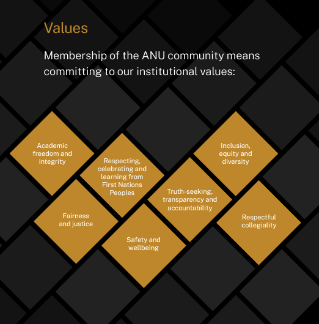
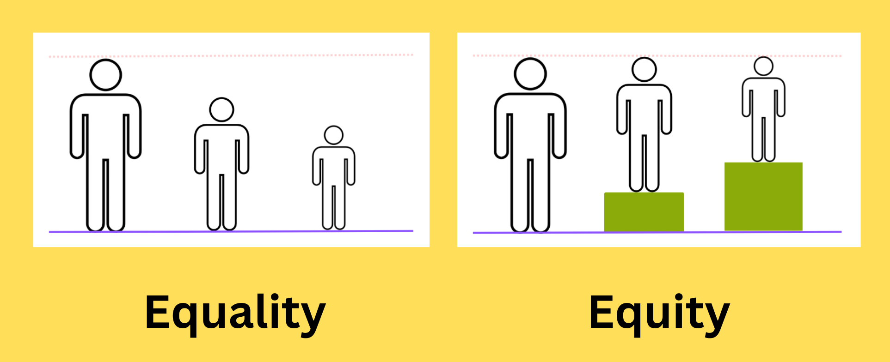
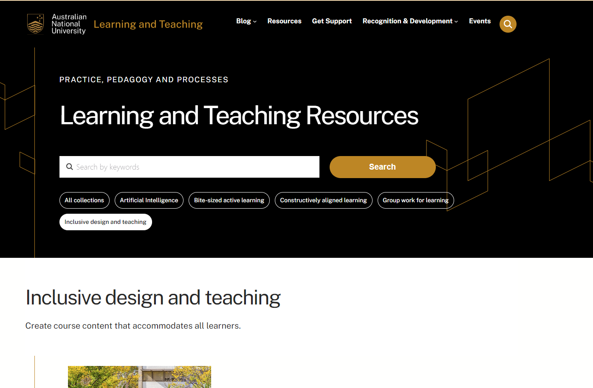

# Inclusive Teaching Practice

Developed from slides provided by __ANU Centre for Learning and Teaching (CLT)__

## Learning outcomes

__In this session we will:__

* __Understand__  the concepts of equitable access to learning, accessibility and inclusive design
* __Develop__ techniques and tools for creating an inclusive learning community in your class
* __Develop__ techniques and tools for facilitating inclusive, respectful, and safe discussions
* __Practise__  these tools and techniques within a safe environment

Notes: read this guide.
<https://unireadytoolkit.com.au/wp-content/uploads/2024/08/Inclusive-teaching-guide.pdf>

# Introduction to Inclusive Teaching Practice

## ANU stance on diversity and inclusion

> Membership of the ANU community means committing to our institutional values, including “being a standard-bearer for equity and inclusion”.

[ANU Strategic Plan 2021-2025](https://www.anu.edu.au/about/strategic-planning/anu-strategic-plan-2021-2025)

## Code of practice for teaching and learning at ANU

  * All involved in L&T
  * Students
  * Teachers

_[Guideline: Code of practice for teaching and learning](https://policies.anu.edu.au/ppl/document/ANUP_000726#:~:text=Teach%20courses%20in%20a%20structured,taught%20content%20and%20assessment%20tasks.)_

## Code of practice: Key points for teaching staff

* _Respect diversity,_  e.g., diversity of culture, religious belief, age, race, gender and other personal and group-based attributes. 
* _Recognise_ that _diversity_ of student and staff  backgrounds, opinions and views _is a valuable resource_ for enhancing critical, motivated and dialogic teaching and learning. 
* _Experience_ an environment that is _equitable, collegial, and responsive to the diversity of individuals.   
* _Contribute_ to an environment _free from harassment, discrimination and bullying_, with access to complaint procedures which will facilitate _speedy and just resolutions._

[Guideline - Code of practice for teaching and learning](https://policies.anu.edu.au/ppl/document/ANUP_000726#:~:text=Teach%20courses%20in%20a%20structured,taught%20content%20and%20assessment%20tasks.)

# Benefits of diversity and inclusion

## Diversity in the classroom

Think-Pair-Share:

> Given that university classrooms are diverse, what  opportunities and benefits does this provide?

1. Think individually (1 min)
2. Pair – discuss with a partner (1 min)
3. Share in class - Listen to participants responses (2 mins)

## Diversity at Columbia Video

[Diversity at Columbia University](https://www.youtube.com/watch?v=-akUss3uj0M)

## An Inclusive Space

Now that you have watched the video, make a note for yourself (1 minute):

> What does inclusive teaching mean to me?

As you develop as teachers, you will either informally or formally develop a teaching philosophy.

# What is equitable access to learning?

## Key definitions

Everyone receives the same support regardless of need.

Individuals receive the support they need to achieve the desired outcomes.

Source: Image by Ciell via [Wikimedia Common](https://commons.wikimedia.org/wiki/File:Equality_vs_Equity.png)

## Barriers to learning

Various factors may lead to difficulties, challenges and barriers for learners depending on context.

* Student factors may be  permanent, temporary  or  situational  for the individual.
* Learning environment factors can be  reduced, alleviated  or  removed  through more inclusive teaching practice.

Barriers could be: Physical, sensory, mental, emotional, cognitive, cultural, social.

You can read more here: [Microsoft Inclusive Design](https://inclusive.microsoft.design/)

## Identifying barriers to learning

Now we are going to consider some of the barriers to learning that our students may experience.

_Think-&-Share_

1. Consider the  student personas  provided. Use these to reflect upon the potential barriers to learning that students at ANU may experience.

2. Write down on some sticky notes (one idea per note) any barriers you can think of.

3. When everyone in your group is ready, explain your sticky notes to your group. Try to identify any common themes.

## Overcoming barriers to learning

> Consider the students you may be teaching and the permanent or temporary or situational barriers to learning that they may face.

_Reflect_: What could you do to help  __reduce__,  __alleviate__ or __remove__ some of these barriers in  _your_  learning environment, content, materials and activities?

_Share_: Spend two minutes sharing ideas with the person next to you.

## Accessibility tools

When thinking about your materials and activities, there are a lot of accessibility situations of which you need to be aware.

Refer to the [ANU Learning and Teaching blog](https://learningandteaching.anu.edu.au/blog/) and [resources](https://learningandteaching.anu.edu.au/resources/).

# Creating inclusive learning communities

## Creating an inclusive space

_Reflect:_

> "You can have accessibility without inclusion, but not inclusion without accessibility."

## The elements of an inclusive space

Inclusive education facilitates the access, participation and success of students.

* Use inclusive language, including respect for choice.
* Allow for individual differences in how students want to access materials and participate in activities.
* Provide accessible materials, content and environments.
* Ensure students can see themselves reflected in materials and activities.

## Creating your own inclusive space

Think. Pair. Share:

* Suggest 1--3 practical changes to content, materials and activities to promote inclusion. 
* Be as specific as you can.
* Think and write each idea on a separate sticky note.
* Share your ideas with your partner.
* Place on the appropriate sheets around the room.

__Think about:__

When teaching, where could you provide diverse representation in your course materials?

How can you ensure your students can see themselves in the materials?

# Facilitating discussion of challenging topics

## Challenging topics

Students typically may need to engage with topics, ideas and concepts that may be challenging, due to:

* polarised or strongly held  __opinions__  or  __ideologies__;
* __lived experience__  of traumatic events or unsafe environments;
* __strong emotions__  or even  __distress__  when engaging directly with this content;
* __prior interactions__  with the teaching staff or other students;
* feeling  __unfairly burdened__  by the expectation of representing a marginalised group(s).

## Challenging topics

__Discuss__:

* What value to students is there in discussing   challenging topics in the classroom?
* How does this help your students?

## Be aware of the difference between…

__Academic discomfort__: The intellectual challenge students experience when they engage with new, complex, or controversial ideas.

__Student distress__: Beyond an intellectual challenge, involving emotional or psychological strain that can hinder a student's ability to learn effectively.

## Promoting an environment for discussion

Consider how you can promote a safe and inclusive space in which challenging topics can be discussed.  

_How might you:_

  * Establish a safe and respectful learning environment?
  * Establish expectations and boundaries?
  * Prepare yourself?

## 1. Establish a safe and respectful learning environment

How would you __create a safe space__ where students feel comfortable expressing their thoughts and opinions without fear of judgment or reprisal?

**Hint**: Where possible, plan to have highly challenging conversations later in the semester, when students have had the opportunity to develop rapport with one another.

Conduct a short, (e.g. 5-minute) check-in at the beginning of tutorials to see how students are feeling about their studies.

Actively model respect for differing perspectives in both asynchronous and synchronous discussions.

Explicitly invite dissenting views from students and model respectful engagement in the discussion. Take care not to single out specific students for dissenting views.

Use an interested and supportive tone when responding to a question, even if you feel that the question was overly simplistic or off topic. Seek clarification from the  student.

## 2. Establish expectations and boundaries

How would you  __ensure there is a mutual understanding__ around course content, student and staff behaviour, and any boundaries that exist?

__HINT: __ Ensure the students know what to do if academic discomfort becomes distress. This should include information about ANU support services.

Remind students of their responsibilities under the Student Code of Conduct.

Establish clear guidelines and boundaries with the students for respecting perspectives and experiences during discussion, e.g. no interruptions, blame or inflammatory language;  use objective language etc.

Seriously consider points-of-view that differ from your current thinking and be open to changing your own perspectives based on what you learn from others.

Emphasise to the students the importance of active listening. One way to frame it is: “Listening and understanding is not the same as agreeing”. Being willing to listen and understand is how learning happens.

## 3. Prepare yourself

How could you prepare yourself for discussing difficult course topics, noting that sometimes unplanned discussions can also occur?

__HINT:__ Check in with your course convenor to ensure that you are adequately prepared and supported.

__The convenor will be able to give you:__   advance notice of the content, expectations around how that content will be managed, and direction to resources for maintaining your own and their students' wellbeing.

Consider how you might deal, emotionally and pedagogically, with potentially challenging topics. Consider how you would respond should you be asked for your view during a challenging discussion.

Think about the kind of behaviour you want to see from your students and how you might promote and model it.

Reflect upon your own preconceptions and assumptions of others.

Do not make assumptions about a student’s identity or to expect them to speak for an entire demographic, ethnic, religious or cultural group.

Speak to your convenor and other teaching staff in your course about how they are planning to approach challenging topics in their own courses.

## Key strategies for engaging with challenging topics.

1. Foster a respectful learning environment
2. Critically review your course content to ensure specific topics are essential to learning.
3. Prepare for and manage both planned and unplanned discussions on difficult topics.
4. Know about and refer students to support services.
5. Seek support for yourself, if necessary.

Source: Student wellbeing in the classroom: A CLT guide to discussing challenging topics for educators.

## Managing unplanned discussions

A suggested approach:

* Decide whether you are __willing to engage__  with the topic and if you are prepared emotionally and pedagogically to continue.
* If you do pursue a discussion, __set a time limit__  for the discussion, and then __look to the strategies provided__ previously for suggestions about facilitating the discussion.
* Be prepared to __step in proactively__ to protect students from inappropriate behaviour from other students using techniques provided above.

## Key stages when managing class discussions

1. Setting the scene
2. Before the discussion
3. During the discussion
4. After the discussion

We will explore a sample of these ideas now. 

## Stage 1: Setting the scene

__From the beginning of semester...​__

Convenor responsibilities: 

- Be transparent about course content and activities.
- Identify where topics are optional

Convenor and tutor responsibilities:

- Establish a safe and respectful learning environment.
- Establish expectations and boundaries.
- Prepare yourself.

## Your responsibilities and limitations

ANU academic and professional staff are not expected to, nor should they, provide counselling, except where they are employed for that specific purpose.

* Know your boundaries
* Consult your convenor
* Refer to experts and professionals
* [Review the ANU Policy: Support for students](https://policies.anu.edu.au/ppl/document/ANUP_7742264)

[ANU Safety and Well-being](https://www.anu.edu.au/students/contacts/student-safety-and-wellbeing)

# Inclusion Anti-Patterns

## Dangerous Patterns for Inclusion

> Can you think of any common teaching patterns that are dangerous for inclusion?

- Doesn't have to be actively hostile to be a bit less inclusive than we would hope.
- Some practices may be less-than-inclusive but necessary or desired (on balance)

## A few ideas...

> We supply the tools, it's up to the students to do the rest.

> All students need to read and fully understand the exercises before attending class.

> Your a third year CS student and you still don't know how to use Linux?

# Principles of Inclusive Teaching

Broadly adapted from:
<https://unireadytoolkit.com.au/wp-content/uploads/2024/08/Inclusive-teaching-guide.pdf>

This guide is designed for students from "underrepresented backgrounds" but it's kindof just good advice!

## Know your students

This will make it easier to see and respond to their needs.

If you know your students you will _want_ to help and in many cases you will _know what to do when you see it_.

## Design Inclusive Curricula

But what can _tutors_ do about this?

- help convenor by communicating course and class structures.
- signpost difficult topics for students, help scaffold them during class.
- clarify expectations for assessments, one good way: "I can't help with the assignment but THIS exercise in the lab is directly related and I CAN help with that".
- help understand **rationale** for assessments.
- provide actionable feedback (within reason)

## Embed Academic Literacies

- Explicity teach academic conventions
- Encourage active engagement in academic texts
- Explicity teach information literacy skills

## Use diverse teaching strategies and resources

- Help students interact and engage: how can we increase collaboration and belonging in our classes?
- Incorporate real-world applications:
- Integrate accessibility into your teaching.

## Create an inclusive classroom environment

- Cultivate a positive and inclusive classroom culture
- Support goal setting and achievement
- Encourage self-reflection
- Promote positive role models

## Embed support systems

- Incorporate help seeking into classes - how can we encourage questions?
- Direct students to available support resources

## Facilitate continuous reflection

- Reflect on the effectiveness of your teaching strategies
- Elicit feedback from students.

# Workshop – Scenarios

Each group will have 10 minutes to work through a scenario and formulate a response to share with everybody.

* _Phase 1:_  _ Think-Pair-Share (Front of sheet)_
  * __Consider __ the  scenario  and  __think__  about your response.
  * __Pair __ with  _another group member_  to share and discuss your thoughts.
  * __Share__  and  __discuss__  your preferred solutions with the group.
* _Phase 2:_  _ Reflection and extension (Back of sheet)_
  * __Consider__  the  “extension” information  and whether it changes your approach.
  * __Discuss__  your thoughts with the group, and  _together_  come up with preferred solutions.
  * __Share __ and __ discuss __ your solutions with the class (extra 2-3 minutes).

## Scenario 0 (Everybody)

_Think-Pair-Share_: You are teaching in an older building on campus. One of your students requires a walking stick for mobility purposes. In the first week, the student has alerted you to the fact and/or you have observed that to attend the class they have to climb three flights of stairs, as there is no lift available.

__Discuss:__

* What do you do?
* Who do you contact?
* What factors need to be considered here?
* What is a short-term solution?

## Scenario 1

Your classes have many international students who are in their first semester of studying in Australia. In Week 3, the students are asked to form groups for a team-based assessment task. You notice that some of the international students are struggling to form teams with the domestic students. This leaves them without a group.

__Extension:__ As part of the assessment task, students submitted a rating of peer contribution. These peer ratings affect the mark allocated to individuals within the group. You note that overall, the international students have consistently received much lower ratings than the domestic students.

## Scenario 2

It is week 4 of semester, your tutorials are running well, and your students are thoroughly engaged in the interactive group tasks that you use in each tutorial. However, one student is always late to the tutorials, which disrupts the class as you must repeat the lesson instructions. They tend not to engage in the tasks and don’t interact with the other students in their group.

 __Extension:__  You take the opportunity to have a chat with them after the week 4 tutorial. They share that they are autistic and have extreme anxiety. They arrive on time for the tutorial but then struggle to enter the room. They feel overwhelmed by the challenges of university.

## Scenario 3

You plan to discuss the changing roles of women in IT. As the topic might be challenging, you have included two 5-minute breaks in the hour-long tutorial to allow processing time and a break if the debate gets heated. Initially, the discussion goes well.​

Then, however, one student repeatedly expresses the opinion that women should not be working in the IT industry. You notice many of the female students progressively disengage from the discussion.​

__Extension:__ There is an assessment task requiring students to respond to statements related to gender roles in the IT industry in the LMS discussion forum. Over the weekend, the same student from the last scenario has written a lot of content that is sexist in content and aggressive in tone.

## Scenario 4

You are teaching in an undergraduate program. You have noticed a change in one of your students. Initially the student was showing up to tutorials on time, neat and tidy and engaged. It is now week 7 and they are arriving late, looking fatigued and not engaging much in tutorial activities.

 __Extension:__  You talk with the student after the tutorial and the student discloses to you that this is their first time living away from home which is a small town in far west NSW. They are feeling very isolated and sad. They have no family or friend support close by so spend a lot of time messaging and talking to their family and friends back home. They are considering not continuing with   uni   after this semester.

## Scenario 5

Your first class is set up and ready to go. To help you remember students’ names, you have printed name tags based on the class roll for correct spelling. One student has arrived early and told you that they hate to be identified by the legal name on their name tag. Other students are arriving, and the session starts in 2 minutes.

 __Extension:__ You wrote their preferred name on the back of the name tag and told the student that you would fix it for next week. During the class, the student is withdrawn and obviously not happy. After the class they disclose to you that they are transgender, and they are finding it difficult to have their name changed. The university bureaucracy is especially frustrating, given that the university says it is supportive of the LGBTQI+ community.
