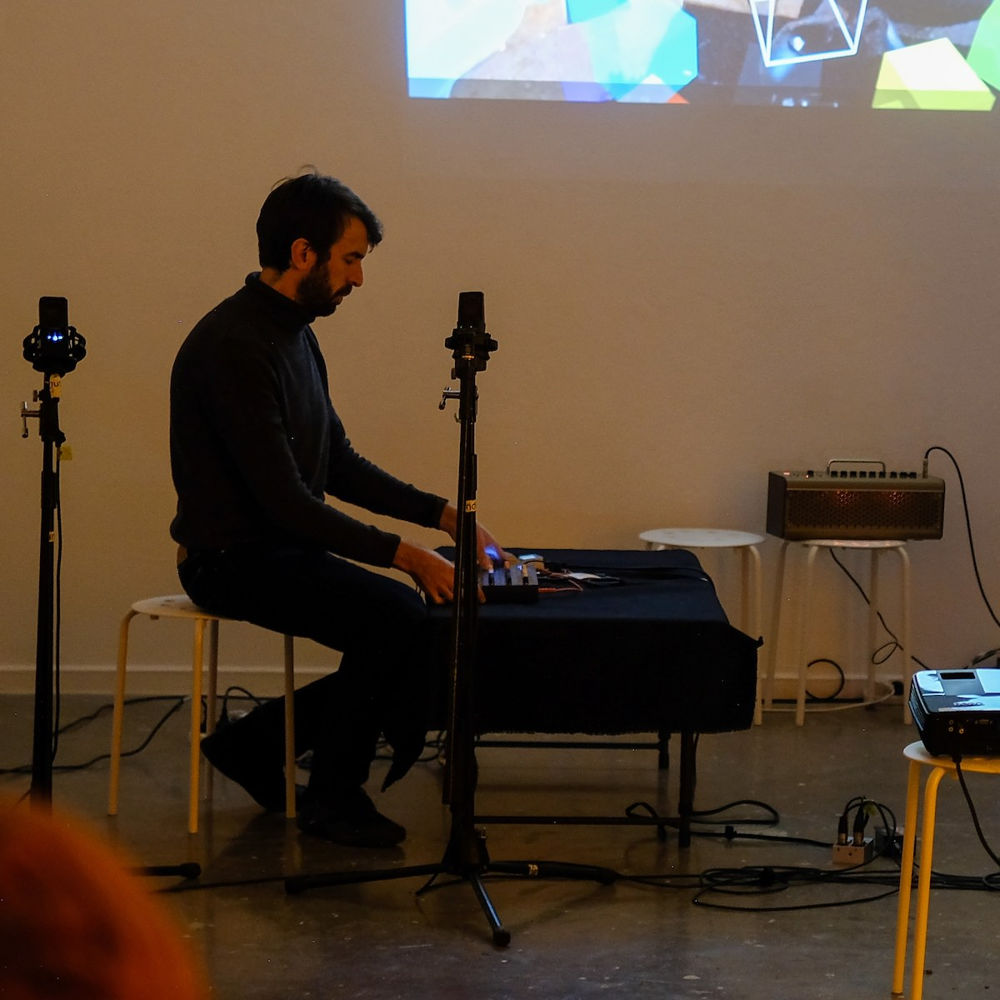
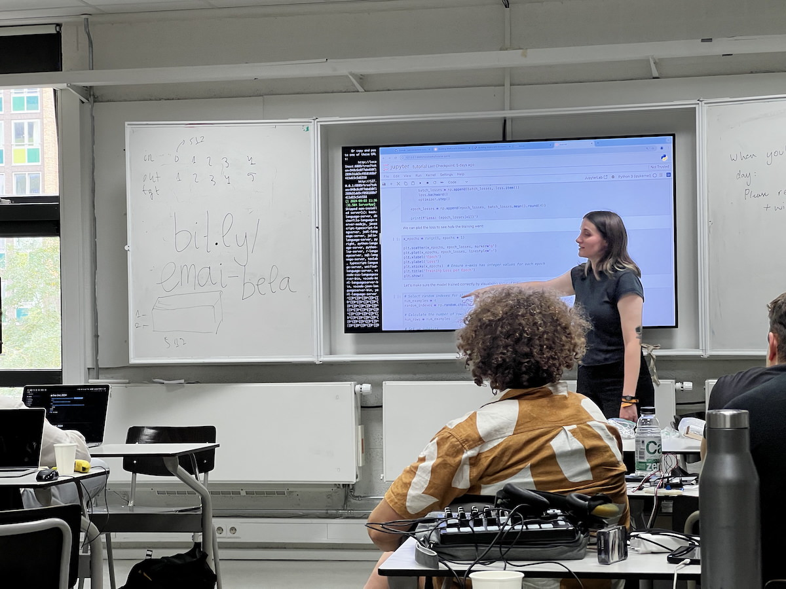

## About me

:::::::::::::: {.columns}
::: {.column width="60%"}
**Charles Martin**

- computer scientist, music technology researcher, performer
- teaching computing at ANU since 2019 (and before that...)
- _Assistant Associate Director Education_, School of Computing
- teaches HCI, music computing, systems, creative coding, etc.
- **lately** responsible for training tutors in our college (~90 in 2025)
- **goal:** make sure our school is an inclusive place to learn computing
:::
::: {.column width="40%"}

:::
::::::::::::::

## Plan for this session

1. Setting out the problem to be solved – how to support educators to teach in an inclusive way to a diverse student cohort
2. Describe some of the things universities have tried.
3. Get tables to list all the things they can think of that could be tried / have been tried.
4. Group discussion to ideate on some these suggestions. 

## Big Problems

:::::::::::::: {.columns}
::: {.column width="60%"}
> our teaching staff make or break inclusion

> they don't know how to help!

> they might be inclusion skeptics ⚠️⚠️

- _Teachers_ in higher ed often have broad autonomy
- Course convenors/lecturers/unit coordinators often in charge of:
    - content, learning activities, assessment
    - decision maker on some types of adjustments and special considerations
    - sets tone for learning environment

:::
::: {.column width="40%"}

:::
::::::::::::::

## Big Questions

:::::::::::::: {.columns}
::: {.column width="50%"}
> what teacher development strategies can help make computing education inclusive?

1. **For engaged colleagues:** what resources and measures can we suggest?

2. **For skeptics:** how can we bring them on side?
:::
::: {.column width="50%"}
{width=100%}
:::
::::::::::::::

## Accessibility vs Inclusion

Concepts are related but not identical. What are the difference in practice?

### Accessibility (foundations)

- **barrier removal:** focuses on eliminating specific obstacles to access learning materials and environments
- **compliance-driven:** requirements in law and ANU policy
- **reactive approach:** (sort of) responds to identified needs through accommodations and modifications (e.g., ANU EAP)

### inclusion (next steps)

- **belonging-focused:** creates environments where all students feel valued, supported, and able to participate fully
- **proactive design:** intentionally shapes the entire educational experience to support diverse learners from the outset
- **community-building:** beyond accommodations to support all students

## Example: Small Class Teacher Training at ANU

:::::::::::::: {.columns}
::: {.column width="60%"}
ANU Centre for Learning and Teaching provided tutor training for computing until 2024.

I stepped in to re-design tutor training for the College of Systems and Society (~90 tutors in 2025).

1.5 hours on inclusive teaching practice:

1. what is inclusion?
2. why does it matter?
3. what can **you** (a casual) do about it?

Adapted strategies from [UniReadyToolkit (link)](https://unireadytoolkit.com.au/wp-content/uploads/2024/08/Inclusive-teaching-guide.pdf) to make sense for tutors.
:::
::: {.column width="40%"}
](img/unireadytoolkit-inclusive-teaching.png){width=70%}
:::
::::::::::::::

## UniReadyToolkit Principles

:::::::::::::: {.columns}
::: {.column width="60%"}
1. know your students
2. **design inclusive curricula and assessments**
3. **embed academic literacies (e.g., hidden curricula)**
4. use diverse teaching strategies and resources
5. create inclusive classroom environment
6. embed support systems
7. **facilitate continuous reflection**
:::
::: {.column width="40%"}
](img/unireadytoolkit-inclusive-teaching.png){width=70%}
:::
::::::::::::::

## Task 1: What have we tried with engaged colleagues?

:::::::::::::: {.columns}
::: {.column width="50%"}
<!-- The idea of this task is to list measures and resources that can be used to develop teachers to support **inclusion** in education. -->

- **list 10 measures to help implement the principles of inclusion**

<!-- The idea of this task is to list 10 measures and resources that can help staff to enact the principles of **inclusion** in education. -->

Rules: This is about developing staff, not policy at department/faculty level.

- **then:** rank the measures and tell us about the top three from each table.
:::
::: {.column width="50%"}
the principles: 

1. know your students
2. design inclusive curricula and assessments
3. embed academic literacies (e.g., hidden curricula)
4. use diverse teaching strategies and resources
5. create inclusive classroom environment
6. embed support systems
7. facilitate continuous reflection
:::
::::::::::::::

## Heard around ANU: why could these statements be problematic?

> We supply the tools, it's up to the students to do the rest.

> All students need to read and fully understand the exercises before attending class.

> All third year CS students should be comfortable using Linux.

> You won't get an extension without a medical certificate.

> You can't use generative AI for any aspect of this course.

> Mobile phones have rotted students brains, they don't understand computers anymore.

How do these statements interact with the idea of _academic standards_?

## Task 2: Dealing with Skeptics Eight Ways

:::::::::::::: {.columns}
::: {.column width="50%"}
- **the task is to _ideate_ measures to bring skeptics on side**

we'll do a Crazy 8s design sprint.

1. fold your piece of paper into 8 sections.
2. start the 8 minute timer
3. sketch one idea in each rectangle
4. stop when the alarm goes off
:::
::: {.column width="50%"}
 is a design sprint method.](img/crazy-8s.png)
:::
::::::::::::::

## What did we learn?

Hopefully something!

<!-- 
## Attendance 1

In your table, discuss ideas for encouraging attendance in your courses, or courses in our school.

Aim for 15 ideas (one Post-It per idea).

Be prepared to share 3 with the room at the end.

Goal is very broad range of tactics!

Be ambitious, chaotic, ruthless, understanding, etc.

Can include ideas you have/haven’t tried, would/wouldn’t do, evidence supported or not.
Can encompass things you could do now or would require course design.
Don’t worry about resources/costs!
Don’t worry about what students might think!
Don’t worry about ANU policy!
Weird and entertaining ideas encouraged!
Only limitations is all ideas will be shared with the school.

## Attendance 2

Do this in Miro – QR code for link!
Each table: share your top tactics (must be unique!) and we will get them on Miro for discussion.
You can start by putting your top tactic on Miro (follow QR code!)
Discussion questions:
Who is responsible for change?
What would it take to make it a reality?
Would it be effective?
Are there disadvantages?

At the end: Collect all the ideas and bring them together to document.
 -->
