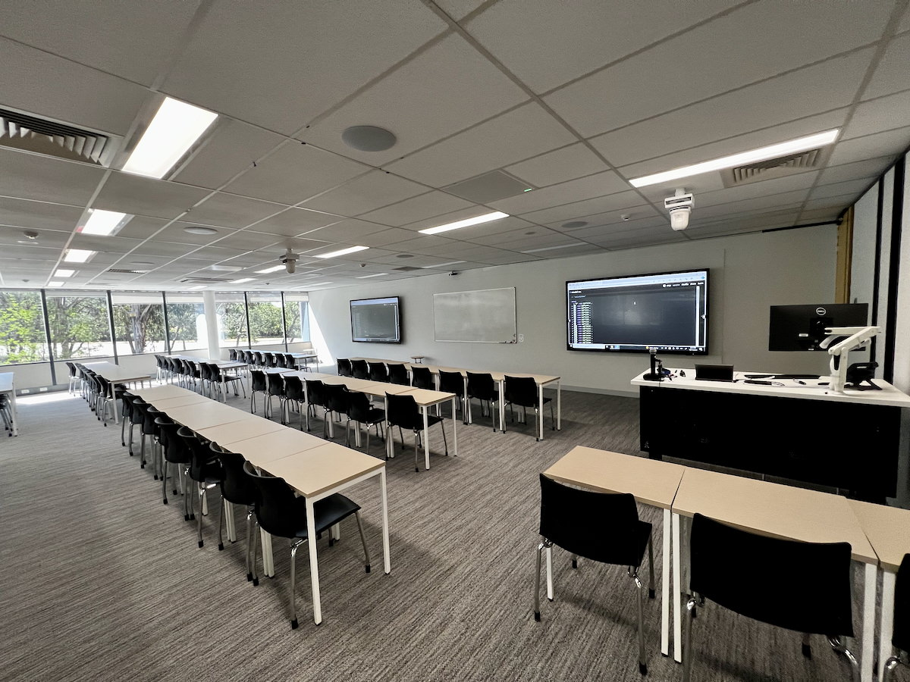

## Acknowledgement of Country

{ width=70% }

## What are the goals for today?

Admin, Reflection and Impact:

- Admin: hours, payslips, timetables, who to ask about what
- Reflection: what challenges have you encountered?
- Strategies: ideas high impact teaching

## Schedule and Groups

- 00:00 1. Admin
- 00:30 2. Reflection
- 01:15 3. Strategies

You'll need to be in table groups for the activities, ideally you would have 4--5 people at your table.

Move around now to adjust the groups!

# Admin Refresher and Updates

{width=50%}

## Task: Journey as an educator (5mins)

:::::::::::::: {.columns}
::: {.column width="60%"}
Everybody here has as an **educator** within the School of Computing, but you may not know each other.

You might also have had some teaching experiences outside of SoCo... (maybe not as a job!)

At your table groups:

1. Introduce yourselves to each other
2. Find out what classes you have previously taught and what you will teach this semester

:::
::: {.column width="40%"}

:::
::::::::::::::

## About Charles 🤖🎶🥁📝

:::::::::::::: {.columns}
::: {.column width="60%"}
**Charles Martin**

- computer scientist, music technology researcher, performer
- teaching computing at ANU since 2019 (and before that...)
- _Assistant Associate Director Education_, School of Computing
- teaches HCI, music computing, systems, creative coding, etc.
- **lately** responsible for training tutors in our college (~90 in 2025, more in 2026...)
- **goal:** make sure teaching in our school is ✨✨awesome✨✨
:::
::: {.column width="40%"}

:::
::::::::::::::

## What work have you been doing as a tutor?

- **Teaching labs:** standing at the front speaking to a whole class, helping individuals with work, answering questions, listening to problems and issues, helping students learn!
- **Marking assessments:** evaluating work (what have students learned?), explaining evaluations, writing feedback, explaining reasoning
- **Meeting with course convenors and other tutors:** going to meetings, understanding duties and tasks, providing ideas/info, incorporating feedback
- **Filling in timesheets, doing admin:** navigating ANU websites, understanding rights/responsibilities at work, asking for help

## Qualifications for teaching (new✨)

> Why did I have to fill in a `docx` form?

HESF (Higher Education Standards Framework) expects universities to have teachers with one degree higher than the taught curriculum.
Some level of professional equivalency allowed given they have **supervision** and **professional development** (PD), e.g.,  

- PhD students allowed to teach master students
- undergrads may teach undergrads provided they have achieved excellent results in the subject
- Other examples, see [ANUP_016608 S28 Table 2](https://policies.anu.edu.au/ppl/document/ANUP_016608)

These rules are not new, but CSS is coming into compliance.

This semester, we learned that the `.docx` form is unhelpful, ongoing process to replace this.

Professional development: training at the start 😇, refresher session every year 👩🏽‍🏫

## Timesheets, hours, and earnings codes

Every two weeks you will need to fill in a timesheet on HORUS (the ANU HR website).
Tricky because of way ANU accounts for teaching hours through "earnings codes" where 1 unit of the code may include more than 1 hour of work.

- T42: Marking: 1-to-1 ratio
- T44: "Other required activity": 1-to-1 ratio
- T21: **Teaching** "Supplementary / scaffolded form of delivery" (that is, tutorials or labs): 1-to-3 ratio (1 hour teaching + 2 hours of "associated working time")
- T23: **Repeat Teaching** "Supplementary / scaffolded form of delivery" (1 hour teaching + 1 hour associated working time)

Source: [ANU Academic Casual Sessional Rates](https://services.anu.edu.au/human-resources/salaries-benefits/academic-casual-sessional-rates)

## What work can be done in associated working time?

ANU Enterprise Agreement [S2.5---S2.6](https://services.anu.edu.au/human-resources/enterprise-agreement/schedule-2-casual-sessional-academic-activities-and-rates)

- Preparing of teaching activities
- _Contemporaneous marking_
- Administration directly associated with a teaching activity
- Face to face consultation immediately prior to and following a face to face teaching activity
- Online consultation (e.g. email, messages, forums) immediately prior to and following an online teaching activity
- Attendance at meetings specifically for the purpose of assisting the CSA staff member to prepare for their teaching activity

## Contemporaneous marking (new✨)

ANU Enterprise Agreement 2023--2026 [S2.6](https://services.anu.edu.au/human-resources/enterprise-agreement/schedule-2-casual-sessional-academic-activities-and-rates)

S2.6:

For the purposes of this provision, 'contemporaneous marking' means marking that is
performed during a teaching activity, or marking work that could have reasonably been
performed during the teaching activity, for example, marking oral presentations delivered
during class.

_so what does "reasonably performed during the teaching activity" mean?_

## Why do we do it this way? (new✨)

- teaching to associated work time ratios are set out in the [Higher Education Industry—Academic Staff—Award 2020](https://awards.fairwork.gov.au/MA000006.html) 16.4[^1]
- tasks for associated working time are in the Enterprise Agreement
- provides guarantees of hours throughout the semester
- protects casual staff against unfair requests from academics (e.g., "You'll have to attend the lecture to find out what to teach! No you don't get paid for that!!")
- provides an automatic allowance for preparation, Q&A and admin work.

[^1]: so Federal Government level rules

**Your manager** needs to provide tasks for you to complete in Associated Working Time.

## A worked example

- Charles the tutor teaches two 1.5-hour labs, 3 hours of work (preparation, marking, admin, consultation and meetings) related to those labs, 
- 3 hours of marking assignments,
- and 1 hour writing test cases for the exam.

| **Code** | **Units** | **Teaching Time** | **Associated Working Time** | **Total Hours Worked/Paid** |
|---|---|---|---|---|
| T21 Teaching | 1.5 | 1.5 | 3 | 4.5 |
| T23 Repeat Teaching | 1.5 | 1.5 | 1.5 | 3 |
| T42 Marking | 3 |  |  | 3 |
| T44 Other | 1 |  |  | 1 |

## School of Computing: 1.5 + 0.5 structure

In the School of Computing, many of our classes have a 1.5 hour teaching + 0.5 hour consultation time structure.

- Computer Lab: 1.5 hours (T21/23 teaching)
- Consultation Time: 0.5 hours (taken from the associated working time)

**Charles advice**:

- at the end of 1.5 hours announce "the tutorial is now over, I am staying until X o'clock to answer individual questions."
- answer questions about any aspect of the course (redirect problem questions to the forum and help the student to write and submit the post).
- don't do any **group teaching** in consultation time.

## Submitting your timesheet

:::::::::::::: {.columns}
::: {.column width="50%"}
Submit your timesheet **on time**. (please!!) 

- suggested submit date is the [last Sunday in each two-week pay period](https://services.anu.edu.au/information-technology/software-systems/hr-online-remote-user-system/timesheet-approval-cut-off).
- actual due date _can change_ due to public holidays.
- and **double check that you get paid!**
- [Timesheets FAQ](https://services.anu.edu.au/information-technology/software-systems/hr-management-system/casual-academic-timesheets-faqs)
:::
::: {.column width="50%"}

:::
::::::::::::::

## Safety: What to do if something bad happens?

⚠️⚠️⚠️ 

Threats of [harassment, bullying, violence (interpersonal, psychological, sexual or physical) or disrupting classes completely](https://policies.anu.edu.au/ppl/document/ANUP_6097481) not acceptable---and not your job to resolve! 

⚠️⚠️⚠️

**Prioritise your safety. Just walk out.**

1. You are in control of your class, if you feel unsafe **walk out!**
2. go to a **safe place** (e.g., Skaidrite Darius Front Office)
3. call **ANU security**: **61252249** or [ANUOK App](https://services.anu.edu.au/campus-environment/safety-security/anuok-app)

## Emergency Buttons and Phones

- Skaidrite Darius labs have a **red panic button** on the wall near the door: ANU Security will visit immediately if the button is pressed.
- Life threatening emergency call **000** from your phone or **0000** from an ANU Phone, then call ANU Security **61252249** (**52249** from internal phone).

Link: [ANU Safety Website](https://services.anu.edu.au/campus-environment/safety-security)

_has anybody ever had cause to call in security or stop a class?_

## Where to get help

:::::::::::::: {.columns}
::: {.column width="50%"}

- Other tutors: course team / communication channels (varies by course)
- Course Convenor (your direct manager)
- School of Computing front desk (Skaidrite Darius Level 3 or <admin.comp@anu.edu.au>)
- Peter Hoefner - Associate Director (Education) in School of Computing: <adir.education.comp@anu.edu.au>
- **me** - Assistant to the above - also <adir.education.comp@anu.edu.au>

:::
::: {.column width="50%"}

:::
::::::::::::::

## Talk: Admin Confusions (5mins)

:::::::::::::: {.columns}
::: {.column width="60%"}
Our work in the classroom and when marking assessments is usually clear, but outside of these activities, things can be a bit more hazy.

At your tables discuss:

- Are there any aspects of your job admin that are confusing?
- What kind of "associated working time" tasks have you been doing?
- How have you managed communication with your convenor and team?

After a few minutes, share some examples with the room.

:::
::: {.column width="40%"}

:::
::::::::::::::

# Reflection: Your educator journey

{width=40%}

## How do people develop as teachers?

@kugel_how_professors_develop_as_teachers describes one pathway of development as university teachers:

- Self
- Subject
- Student...

As educators we also learn and are influenced by our environment, experiences, and self.

Let's review these phases (presented in new-starter training...) and reflect on your progress as a teacher.

## Phase 1: Emphasis on Teaching

:::::::::::::: {.columns}
::: {.column width="60%"}
1. **Focus on self**: Survival in front of a class! Learning how to explain, fear of not knowing the "right" answers.
2. **Focus on subject**: Covering the topic thoroughly (more than a student!). Preparing packaged, inspiring, and interesting content.  Fear of running out of time!
3. **Focus on student**: Students are different! Prepare alternatives formulas and explanations. Learn about student needs, awareness of multiple valid approaches.
:::
::: {.column width="40%"}

:::
::::::::::::::

## Phase 2: Emphasis on Learning

:::::::::::::: {.columns}
::: {.column width="60%"}
4. **Student as active**: Let students do the work! Coaching students in applied learning activities. Teaching less, but more learning occurs.
5. **Student as independent**: Coach students in learning how to learn. Let students independently explore. (What knowledge will be important in computing in 20 years?)
6. **Tuning**: Established skills in previous stages. Move between stages as necessary, updating and experimenting.
:::
::: {.column width="40%"}

:::
::::::::::::::

## Risks

Early stages:

- Great content, students not engaging and not learning.
- Overwhelm students with explanations: answering questions not asked.
- Frustrating when student don't find this fascinating topic interesting!

Later stages:

- Getting students to **do** things: tricky.
- Teaching _less_ doesn't mean _nothing_: still need telling/showing (explicit teaching).
- Need to do _listening_ and _questioning_: these are hard skills.
- Students annoyed! "Just tell me what to do!!"

## Task: What stages resonates for you? (10mins)

:::::::::::::: {.columns}
::: {.column width="60%"}
Think about the phases/stages of teaching described in @kugel_how_professors_develop_as_teachers

- Focus on self
- Focus on subject
- Focus on student
- Student as active
- Student as independent
- Tuning

> What stages resonate for you and why? Where are you on your teaching journey?

Discuss in your groups and we will come together to hear some responses.
:::
::: {.column width="40%"}

:::
::::::::::::::

## Task: Joys and Challenges (5mins)

:::::::::::::: {.columns}
::: {.column width="60%"}
Reflect on the teaching experiences that you have had and think about the highs and lows

- What **do you enjoy** about tutoring?
- What challenges **have you faced** or do you **expect to face** as a tutor?
- What aspects of tutoring would you most like support with?

Discuss with your group and then we'll hear some example of each question from each table.
:::
::: {.column width="40%"}

:::
::::::::::::::

# Strategies: High Impact Teaching Strategies

:::::::::::::: {.columns}
::: {.column width="60%"}
In this section we will think about how to make our teaching _better_, given the resources and agency we have as tutors.

I'll go through a resource called _High Impact Teaching Strategies_ and we will try to align these to our work in computing.

HITS summarises evidence-backed teaching strategies [e.g., from studies reported in @hattie_visible_learning]
:::
::: {.column width="40%"}

:::
::::::::::::::

## High Impact Teaching Strategies

:::::::::::::: {.columns}
::: {.column width="60%"}
@high_impact_teaching_strategies

1. Setting Goals
2. Structuring Lessons
3. Explicit Teaching
4. Worked Examples
5. Collaborative Learning
6. Multiple Exposures
7. Questioning
8. Feedback
9. Metacognitive Strategies
10. Differentiated Teaching
:::
::: {.column width="40%"}

:::
::::::::::::::

## 1. Setting Goals

Lessons have clear learning intentions with goals that clarify what success looks like.

- Students see what they need to understand and do
- Teachers can focus on meeting the goals
- Links to explicit assessment criteria

_both students and teachers need to see the goals!_

## 2. Structuring Lessons

A lesson structure maps teaching and learning that occurs in class.

- clear expectations
- learning is sequenced and linked
- scaffolding

## 3. Explicit Teaching

Students are clearly shown what to do and how to do it.

- intentions and success criteria are made transparent to students
- teacher demonstrates them by modelling
- teacher checks for understanding

## 4. Worked Examples

A worked examples demonstrates the steps required to complete a task or solve a problem.

Teacher presents the example and explains each step. Later, students use the example during independent practice.

- scaffolds learning to support skill acquisition
- reduces cognitive load
- supports independent practice

## 5. Collaborative Learning

Students work in small groups and everyone participates in a learning task.

- many approaches with different kinds of organisation
- students work together applying acquired knowledge
- cooperatively solve problems
- fosters peer learning
- competition between groups

## 6. Multiple Exposures

Students get multiple opportunities to encounter, engage with, and elaborate on new knowledge and skills.

- deep learning needs time
- spaced-out interaction with knowledge supports learning
- space out practice with different activities to vary interaction with knowledge

## 7. Questioning

Questioning is a technique to help students gain cognitive tools for learning _themselves_ rather than presenting _answers_ (remember our intro training?)

- yields feedback on student understanding
- supports informal feedback
- engage students, stimulates interest and curiosity in the learning, and makes links to students lives
- plan questions for probing, extending, revising and reflecting
- use open questions
- cold call and strategic sampling can be used

## 8. Feedback

Feedback informs a student and/or teacher about the student's performance relative to learning goals.

- redirects actions to align with learning goals
- feedback can be from teachers or peers
- can be informal or formal
- can be oral, written, formative, or summative
- always needs to be specific and actionable (remember intro training!)

## 9. Metacognitive Strategies

Metacognitive strategies teach students to think about their own thinking.

- students who are aware of learning process gain control over learning
- extends to self-regulation; managing one's own motivation
- can include planning approach to tasks
- evaluating progress and monitoring comprehension

This can involve explicitly teaching problem solving, study skills, and self-questioning

## 10. Differentiated Teaching

Methods teachers use to extend the knowledge and skills of every student in every class, regardless of their starting point.

- lift performance of all students
- including those falling behind
- including those way ahead
- effective differentiation: lessons incorporate adjustments for content, process, and product

## Summary page of the HITS

:::::::::::::: {.columns}
::: {.column width="50%"}
{width=80%}
:::
::: {.column width="50%"}
{width=80%}
:::
::::::::::::::

## Task: Which strategies resonate? (5mins)

:::::::::::::: {.columns}
::: {.column width="60%"}
Now you have heard about the HITS, which of these resonate to you?

Discuss at your table:

> Which strategy(ies) resonate with your experience and philosophy as a teacher, and why?

We'll come together to hear some responses. Each table needs to pick **one strategy** to focus on for the next task.
:::
::: {.column width="40%"}
1. Setting Goals
2. Structuring Lessons
3. Explicit Teaching
4. Worked Examples
5. Collaborative Learning
6. Multiple Exposures
7. Questioning
8. Feedback
9. Metacognitive Strategies
10. Differentiated Teaching
:::
::::::::::::::

## Task: making concrete plans (15mins)

:::::::::::::: {.columns}
::: {.column width="50%"}
- **the task is to _ideate_ ways to apply _one_ HIT strategy in SoCo**

we'll do a Crazy 8s design sprint.

1. fold your piece of paper into 8 sections.
2. start the 8 minute timer
3. sketch one application of the HIT strategy in each rectangle
4. stop when the alarm goes off

After the sprint, you will analyse the sketches you have ideated and choose **one** to present to the group.
:::
::: {.column width="50%"}
 is a design sprint method.](img/crazy-8s.png)
:::
::::::::::::::

# Questions: Who has a question?

:::::::::::::: {.columns}
::: {.column width="60%"}
**Who has a question?**

_We're at the end of our refresher, I'll try to leave some time for general questions. If we don't have time, feel free to get in touch to ask questions later!_

:::
::: {.column width="40%"}

:::
::::::::::::::

# References {.allowframebreaks}
